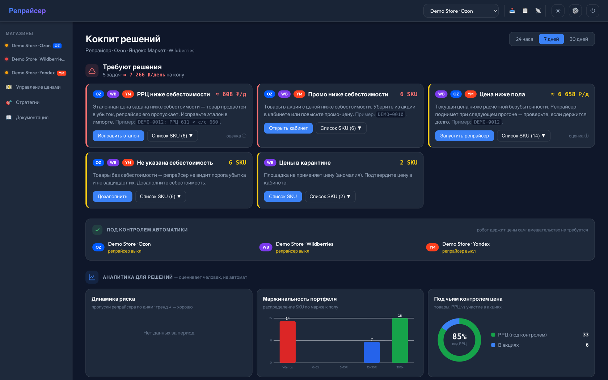
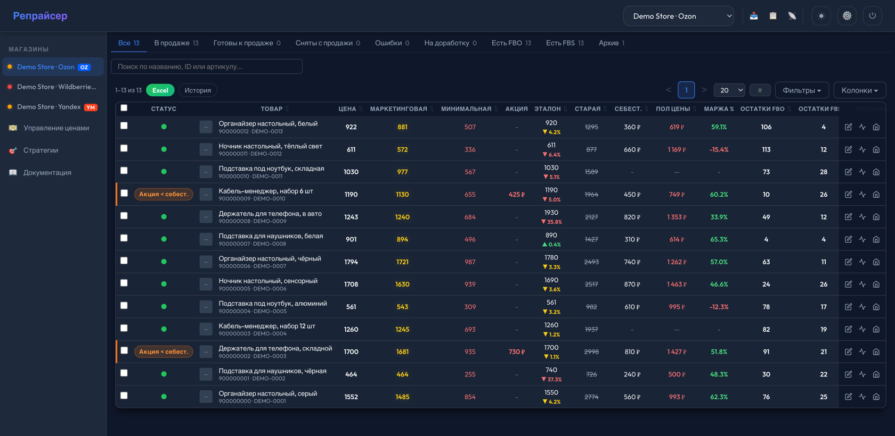
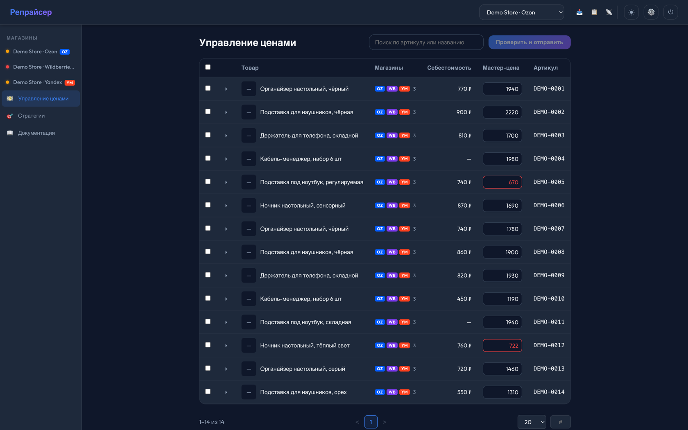
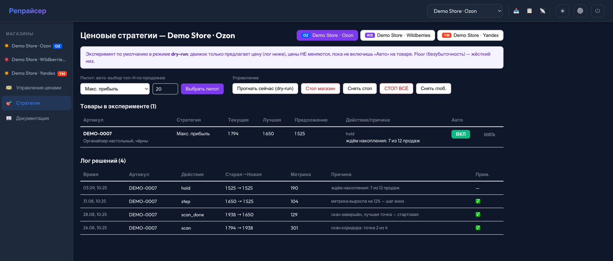
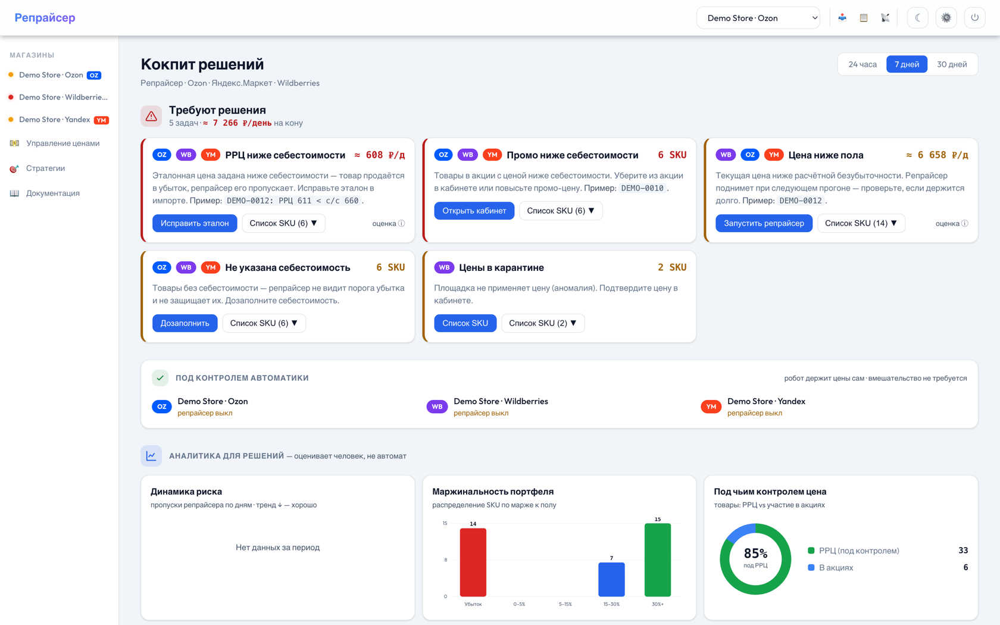

# Репрайсер для Ozon, Wildberries и Яндекс.Маркета

Автоматическое управление ценами и динамическое ценообразование для продавцов на **Ozon**, **Wildberries** и **Яндекс.Маркете**.

Держит цену на заданном эталоне (РРЦ), не даёт продавать ниже безубыточности, рассчитанной по реальным тарифам каждой площадки, выводит товары из акций, которые уводят их под себестоимость, и — при желании — сам ищет лучшую цену, ставя управляемый эксперимент на живых продажах.

По сути это самописный репрайсер и система автоматизации цен на маркетплейсах: юнит-экономика по каждому SKU, контроль маржи, работа с акциями и остатками.

**[English](README.md) · [中文](README.zh.md)**

> **Программа меняет реальные цены в реальных магазинах.** Прочитайте [SECURITY.md](SECURITY.md), прежде чем подключать боевой кабинет. Любая запись по умолчанию идёт в режиме dry-run — реальную отправку нужно запросить явно.

---

## Зачем это написано

Маркетплейс — не нейтральная площадка. Он сам затаскивает товары в скидки, которых вы не согласовывали. Он берёт комиссию, которая меняется по категории и по складу. Он списывает за буст через удержания, о которых ни один эндпоинт API вам прямо не скажет. Цена, выглядевшая прибыльной в таблице, тихо перестаёт быть прибыльной — и вы узнаёте об этом в конце месяца.

Этот проект написан, чтобы вести три работающих магазина. Каждое правило в нём появилось после того, как отсутствие этого правила стоило денег.

---

## Что умеет

### Держит эталонную цену

Репрайсер сравнивает живую цену площадки с вашим эталоном (`ref_price`) и восстанавливает её, когда площадка уводит цену в сторону. Товары в акции, в карантине, в эксперименте и в режиме вывоза пропускаются, а каждый SKU попадает ровно в одну категорию итога — `ok`, `corrected`, `skipped_promo`, `skipped_quarantine`, `skipped_below_cost`, `rejected` — так что лог никогда не врёт о том, что произошло.

### Считает безубыточную цену отдельно для каждой площадки

Не одна формула с флагом площадки. Три по-настоящему разные модели, потому что экономика разная:

| Площадка | Модель |
|---|---|
| **Ozon** | Комиссия, логистика и эквайринг из живого ответа `/v5/product/info/prices`, налог вложен от нетто |
| **Яндекс.Маркет** | Налог с **валовой** выручки (УСН «Доходы») плюс фактическая ставка буста, восстановленная из `stats/orders` — эндпоинт тарифов её не отдаёт |
| **Wildberries** | Комиссия FBO по `subject_id`, логистика по объёму короба, обратная логистика с поправкой на долю невыкупа |

Ставка налога, равная нулю, трактуется как ноль процентов, а не как «выключено» — защита работает и в этом случае.

### Выводит товары из акций

Работает по живому списку акций на площадке, а не по локальной копии, которая могла устареть. Замороженные акции пропускаются, недоудалённое подбирается следующим прогоном, а на Ozon дополнительно ставится самозапрет — чтобы площадка перестала добавлять товары автоматически. Белый список разрешённых акций и предел глубины скидки оставляют те кампании, в которых вы действительно хотите участвовать.

У Wildberries нет эндпоинта выхода из акции, поэтому выход реализован восстановлением пары `{цена, скидка}` через Prices API.

### Одна мастер-цена на три площадки

Задаёте цену, которую должен видеть покупатель, — она разворачивается в правила каждой площадки: `price` / `old_price` / `min_price` Ozon с ограничениями 50% и 2×, пара «база + скидка» у Wildberries (цену покупателя там задать нельзя), `price` с `discountBase` в допустимом коридоре 5–99% у Яндекса. Сначала dry-run, перед отправкой — снимок для отката, по одному пакету на магазин ради лимитов.

### Ищет лучшую цену экспериментом

Большинство репрайсеров применяют правило. Этот умеет вести поиск.

При 0,3–5 продажах в день на SKU честный A/B-тест статистически невозможен — ему нужны сотни продаж на каждую ценовую точку. Поэтому вместо него: **ступенчатый поиск внутри одного SKU (ladder) с байесовской оценкой спроса на гамма-пуассоновской модели**, событийный критерий остановки, гистерезис и уменьшение шага по мере сходимости. Решение принимается по **нижнему перцентилю** апостериорной интенсивности, а не по среднему, — так малая выборка не уговорит движок на цену, которую он не заслужил.

Пять типов стратегий: `ref_price` (без эксперимента), `max_profit`, `max_revenue`, `max_units` при ограничении на маржу и `liquidation`. Дни, испорченные стокаутом, акцией, всплеском рекламы или сдвигом СПП, помечаются и исключаются из оценки спроса.

Проверено симуляцией Монте-Карло против известного оптимума (`scripts/simStrategy.cjs`): разрыв с теоретическим максимумом около 2% для `max_profit` и `max_units`, 12% для `max_revenue` — оптимум выручки действительно пологий.

Устройство описано в [docs/ru/strategies.md](docs/ru/strategies.md).

### Проверяет, что цены действительно применились

Площадки отвечают успехом на изменения, которых не сделали. Через три минуты после каждой отправки цена перечитывается, и запись помечается `VERIFIED_OK` или `VERIFIED_FAIL`. Ozon вдобавок возвращает HTTP 200 с ошибками внутри позиций — они разбираются и пишутся в лог как отказы, а не считаются успехом.

### Следит за тем, что чужой API не сломался

Явный реестр связывает каждую функцию репрайсера с эндпоинтами, от которых она зависит. Ежечасно идут лёгкие пробы (`limit=1`) — 404 означает, что API изменился, — а параллельно работает детектор деградаций, сравнивающий текущие отказы с историей самого эндпоинта. Алерты уходят в Sentry.

### Кокпит решений вместо дашборда метрик

Девять типов задач, ранжированных по деньгам под риском: эталон ниже себестоимости, промо-цена ниже себестоимости, цена ниже пола, площадка давит под пол, изменения не применились, карантин, неудавшийся выход из акции, нет себестоимости, нет данных о продажах. На каждой карточке — сумма под риском и действие, которое её закрывает.

### HTTP-контур управления для LLM-агентов

`/api/ext/v1` — межмашинный API за Bearer-ключом, белым списком IP и лимитом запросов. Рассчитан на случай, когда **несколько LLM-агентов в разных чатах** управляют одним каталогом.

Не дать им затирать решения друг друга — задача про конкурентный доступ, и решена она соответственно:

- **Версионированный контекст.** Каждая запись цены обязана нести текущий `context_version`. Устаревший отклоняется кодом `409`, и свежий контекст возвращается в том же ответе — та же идея, что `ETag` / `If-Match`.
- **Владение SKU.** Товар в режиме `experiment` или `liquidation` может писать только владеющий им агент; товар в `disposal` заморожен полностью.
- **Policy-рельсы.** Предел изменения за одну запись, подтверждение массовых операций сверх порога, контроль пола цены и отказ для SKU, у которых пол неизвестен.
- **Журнал решений и брифинг.** Агенты фиксируют решения, намерения и политики; сервер генерирует брифинг в Markdown и отслеживает, какой агент подтвердил какую версию контекста.
- **Единственный источник истины по прибыли.** `GET /stores/:id/pnl` — единственный разрешённый способ её посчитать, и он честно излагает свою методику, включая то, чего он не вычитает.

Подробности: [docs/ru/api-external.md](docs/ru/api-external.md) и [docs/ru/llm-agent.md](docs/ru/llm-agent.md).

---

## Настройка магазина — из интерфейса, без правки файлов

Магазин добавляется в разделе «Настройки»: выбираете площадку, вставляете ключи из кабинета продавца — и всё. Ни конфигов, ни перезапуска, ни переменных окружения: ключи хранятся в базе, а не в `.env`, поэтому кабинетов можно завести сколько нужно, каждый со своими настройками.

Основная часть настроек — про экономику, и задаются они **для каждого магазина отдельно**, потому что налоговый режим и целевая маржа у разных юрлиц разные:

| Настройка | Что делает |
|---|---|
| **Налоговая ставка** | Входит в расчёт безубыточной цены. Ноль — это ноль процентов (патент, НПД), а не «выключено» |
| **Минимальная маржа** | Сколько вы хотите зарабатывать сверх себестоимости. Поднимает пол цены |
| **Порог падения / роста** | На сколько процентов цена должна отклониться от эталона, чтобы репрайсер вмешался. Защита от дёрганья из-за копеек |
| **Интервал репрайсера** | Как часто проверять цены — от минут до часов |
| **Потолок буста в floor** | Ограничение сверху на восстановленную ставку буста Яндекса, чтобы аномалия в статистике не задрала пол |
| **Макс. шаг роста цены за прогон** | Не даёт поднять цену слишком резко за один раз |
| **Защита от убыточных акций** | Убирать из акции товары, чья промо-цена ниже себестоимости |
| **Автовывод из акций** | Выводить товары из акций, которых нет в белом списке |
| **Макс. скидка в разрешённых акциях** | Даже разрешённая акция не должна уводить цену глубже этого процента |
| **Антибан** | Пауза между запросами к площадке |

Всё это меняется на ходу и применяется со следующего прогона.

---

## Управление ценами через LLM-агента

У репрайсера есть внешний HTTP-API (`/api/ext/v1`), рассчитанный на то, что с ним работает языковая модель. На практике это выглядит как обычная просьба:

> «Снизь цены в магазине X на 20%»
> «Подними цены во всех магазинах на 30%»
> «Проверь гипотезу: что будет с этой группой товаров при цене на 15% ниже»

Ценность не в том, что команду можно сказать словами, а в том, что **агент не может ею навредить**. Между просьбой и площадкой стоят рельсы, которые знают то, чего не знает модель:

**Резкое изменение цены — ступенчато, в обе стороны.** Площадки наказывают за резкие движения, и репрайсер знает пороги.

Вниз: Wildberries отправляет товар в карантин при падении цены более чем в полтора раза — цена не применяется, товар выпадает из выдачи. Если цель ниже порога, репрайсер идёт к ней за несколько прогонов, каждый раз оставаясь чуть мягче. Это ограничение появилось не из документации: движок экспериментов однажды попытался уронить цену сразу к полу, на 40–50%, и это поймал dry-run пилот. В ценовых экспериментах оно тоже действует и помечается в логе как `карантин-кап`.

Вверх: шаг роста ограничен отдельной настройкой магазина (по умолчанию 20% за прогон), чтобы цена не подскочила разом. Команда «подними на 50%» выполнится за несколько циклов, а не одним рывком.

Между шагами цена перечитывается с площадки — следующий шаг делается от того, что реально применилось, а не от того, что мы отправили.

**Проверка, что цена действительно применилась.** Через три минуты после отправки цена перечитывается с площадки. Площадки нередко отвечают «успешно» на изменение, которого не сделали; такая запись помечается `VERIFIED_FAIL`, и вы это видите, а не узнаёте через месяц.

**Работа с акциями.** Изменение цены может затащить товар в акцию — площадка делает это сама. Следующий цикл автовывода (по умолчанию раз в 5 минут) вытащит его обратно, если акции нет в белом списке или скидка глубже разрешённой.

**Лимиты на сам запрос.** Изменение больше 15% от эталона за одну запись отклоняется. Операция больше чем на 200 SKU требует явного подтверждения. Товар без известной себестоимости не примет новую цену вообще — пола нет, значит защиты нет. Все пороги настраиваются.

**Понятно, кто что сделал.** Каждый вызов агента пишется в журнал: кто, что, сколько позиций затронул. Перед массовой записью делается снимок цен, к которому можно откатиться.

Если агентов несколько — каждый в своём чате, — они не затирают решения друг друга: у контекста есть версия, устаревшая запись отклоняется, товар в эксперименте принадлежит тому агенту, который его ведёт. Подробности — в [инструкции для агента](docs/ru/llm-agent.md) и [описании API](docs/ru/api-external.md).

> Отдельно от репрайсера у автора есть MCP-серверы для [Ozon](https://github.com/DeviceIngineering/ozon-mcp-server) и [Wildberries](https://github.com/DeviceIngineering/wb-mcp-server) — они дают модели доступ к кабинетам напрямую. Этот репозиторий MCP-сервера не содержит: здесь HTTP-API, и подключить к нему агента можно любым удобным способом.

---

## Как это выглядит

**Кокпит решений** — не дашборд метрик. Каждая карточка — проблема с суммой под риском и кнопкой, которая её закрывает.



**Таблица товаров** — эталон и отклонение от него, себестоимость, расчётный пол, маржа, метки акций, остатки. Всё, на чём репрайсер принимает решение, в одной строке.



**Одна мастер-цена на три площадки.** Один и тот же артикул продаётся на Ozon, Wildberries и Яндекс.Маркете; вы задаёте цену для покупателя один раз, а она разворачивается в правила каждой площадки. Цены ниже себестоимости подсвечиваются до отправки.



**Ценовой эксперимент и его рассуждения.** В логе видно, что движок сделал и почему: скан коридора, шаг ladder, ожидание накопления данных. Ничего не применяется, пока вы не включите «Авто» на товаре.



Обе темы поддерживаются:



### Посмотреть без подключения магазина

```bash
npm run demo                                             # наливает demo.db и запускает приложение
DB_PATH=./demo.db ADMIN_PASSWORD='минимум-12-символов' npm run seed   # один раз, чтобы войти
```

Наливает синтетический каталог — три магазина, 42 товара, 60 дней продаж, среди них специально есть позиции ниже пола, акции ниже себестоимости, товары без себестоимости и один живой эксперимент — в `demo.db` и запускает приложение. Никаких ключей, никаких обращений к маркетплейсам. Скриншоты выше — это ровно то, что вы получите.

---

## Где это запускать

Программа не требует ничего, кроме Node.js: один процесс, одна база SQLite в файле. Отсюда два способа жить с ней.

**На своём компьютере.** Подходит, чтобы посмотреть, попробовать на одном магазине, разобраться в логике. Ограничение очевидное: репрайсер работает, пока компьютер включён. Закрыли ноутбук — цены никто не держит, из акций никто не выводит, продажи за этот день не собрались.

**На арендованном сервере (VPS).** Способ, ради которого всё и делалось: программа работает круглосуточно и без вас. Раз в минуту проверяет, не пора ли запустить репрайсер, ночью собирает продажи и делает резервную копию, ежечасно проверяет, не сломался ли чужой API.

Самой маленькой VPS достаточно:

| | Минимум | Комфортно |
|---|---|---|
| Процессор | 1 ядро | 2 ядра |
| Память | 1 ГБ | 2 ГБ |
| Диск | 10 ГБ | 20 ГБ и больше |
| Система | любая с Docker или Node 20 | — |

По диску ориентир такой: база растёт вместе с историей цен, логами запросов и продажами по дням. У автора за полгода работы восьми кабинетов она заняла около 500 МБ. Встроенный ежесуточный бэкап в S3-совместимое хранилище стоит включить сразу.

Сервер должен иметь **постоянный IP от нормального провайдера и не работать через VPN** — это прямое требование правил Ozon Seller API, и нарушение бьёт по вашему кабинету, а не по программе. Порт наружу выставлять не нужно: если хотите заходить в интерфейс извне, поставьте перед приложением обратный прокси с TLS (см. [SECURITY.md](SECURITY.md)).

Разворачивание на сервере — `docker compose`, подробности в [руководстве по установке](docs/ru/installation.md).

---

## Проверено в бою

Программа не написана «на будущее» — она ведёт реальную торговлю с марта 2026 года.

- **Восемь личных кабинетов одновременно:** три на Ozon, два на Wildberries, три на Яндекс.Маркете.
- Все три площадки работают параллельно, с разными налоговыми настройками и разной экономикой.
- Кабинетов может быть сколько угодно: они просто строки в таблице, каждый со своими ключами и своим расписанием.

**О пределе масштабирования — честно.** По опыту автора потолок наступает где-то на **15–20 кабинетах одной площадки**: с одного IP-адреса площадка начинает ограничивать запросы. Это оценка, а не измеренный предел, и зависит она от размера каталога и частоты прогонов. Система проксирования не реализована — если вам нужно больше кабинетов, её придётся добавить самостоятельно, либо разнести кабинеты по нескольким серверам.

---

## Стек

Node.js 20 · Express 5 · better-sqlite3 (синхронный) · node-cron · better-auth
React 19 · Vite 7 · TypeScript 5.9 · CSS-модули — без UI-библиотек и без стейт-менеджера
SQLite, один файл, WAL · многослойный Dockerfile · Sentry (опционально)

Около 35 000 строк. 155 тестов на ценовую математику, движок стратегий, парсер таблиц, аутентификацию внешнего API и запросы кокпита.

---

## Быстрый старт

**Требуется:** Node 20+ и инструменты сборки нативных модулей (`python3`, `make`, `g++`) — `better-sqlite3` компилируется при установке.

```bash
git clone https://github.com/DeviceIngineering/ozon-wildberries-repricer.git && cd ozon-wildberries-repricer
npm ci

cp .env.example .env
# Сгенерируйте секрет сессий и впишите его в .env как BETTER_AUTH_SECRET:
openssl rand -hex 32

# Создайте первого администратора (пароль от 12 символов)
ADMIN_PASSWORD='ваш-надёжный-пароль' npm run seed

npm run dev:all          # API на :3001, интерфейс на :5173
```

Команды миграции нет. Схема и все миграции выполняются автоматически при старте процесса.

Дальше откройте приложение, войдите и добавьте магазин в **Настройках**. Понадобятся ключи из кабинета продавца — какие именно доступы нужны каждой площадке, написано в [docs/ru/installation.md](docs/ru/installation.md).

### Docker

```bash
cp .env.example .env      # задайте BETTER_AUTH_SECRET
docker compose up --build
```

Для прода поставьте перед приложением обратный прокси с TLS и укажите в `BETTER_AUTH_URL` адрес на `https://` — кука сессии помечается `Secure` только по HTTPS:

```bash
docker compose -f docker-compose.yml -f docker-compose.prod.yml up -d --build
```

### Тесты

```bash
npm test              # vitest
npm run typecheck     # tsc --noEmit
npm run lint
npm run build
```

---

## Настройка

Все переменные описаны в [`.env.example`](.env.example). Обязательных всего две: `BETTER_AUTH_SECRET` и `BETTER_AUTH_URL`.

Ключи маркетплейсов — **не** переменные окружения: они вводятся для каждого магазина в интерфейсе и хранятся в базе. Что это означает для способа развёртывания, написано в [SECURITY.md](SECURITY.md).

---

## Документация

| | Русский | English | 中文 |
|---|---|---|---|
| Установка | [ru](docs/ru/installation.md) | [en](docs/en/installation.md) | [zh](docs/zh/installation.md) |
| Руководство пользователя | [ru](docs/ru/user-guide.md) | [en](docs/en/user-guide.md) | [zh](docs/zh/user-guide.md) |
| Архитектура | [ru](docs/ru/architecture.md) | [en](docs/en/architecture.md) | [zh](docs/zh/architecture.md) |
| **Как формируется цена** | [ru](docs/ru/pricing.md) | [en](docs/en/pricing.md) | [zh](docs/zh/pricing.md) |
| Ценовые стратегии | [ru](docs/ru/strategies.md) | [en](docs/en/strategies.md) | [zh](docs/zh/strategies.md) |
| Внешний API | [ru](docs/ru/api-external.md) | [en](docs/en/api-external.md) | [zh](docs/zh/api-external.md) |
| Инструкция LLM-агенту | [ru](docs/ru/llm-agent.md) | [en](docs/en/llm-agent.md) | [zh](docs/zh/llm-agent.md) |

---

## Статус и границы применимости

Это работающая программа, извлечённая из действующей установки, а не продукт с договором поддержки. Она писалась под три магазина одного продавца; ваш ассортимент, налоговый режим и структура складов будут другими, а часть констант калибровалась под конкретную товарную матрицу. Прежде чем считать какое-либо значение по умолчанию подходящим вам, прочитайте [docs/ru/architecture.md](docs/ru/architecture.md).

Интерфейс на русском — потому что пользуются им продавцы российских маркетплейсов. Документация на трёх языках. Код, комментарии и сообщения коммитов постепенно переводятся на английский.

Пул-реквесты приветствуются — см. [CONTRIBUTING.md](CONTRIBUTING.md).

---

## Отказ от ответственности

Программа действует в вашем кабинете, под вашими ключами, от вашего имени. Вы отвечаете за то, что она там делает, — в том числе за соблюдение правил каждой площадки и оферты, которую вы приняли как продавец. Авторы не дают никаких гарантий и не несут ответственности за упущенную маржу, блокировки кабинета и любые другие последствия её работы.

Не направляйте её на боевой магазин, пока не понаблюдаете за её работой в режиме dry-run в течение полного цикла.

---

## Лицензия

MIT — см. [LICENSE](LICENSE).
