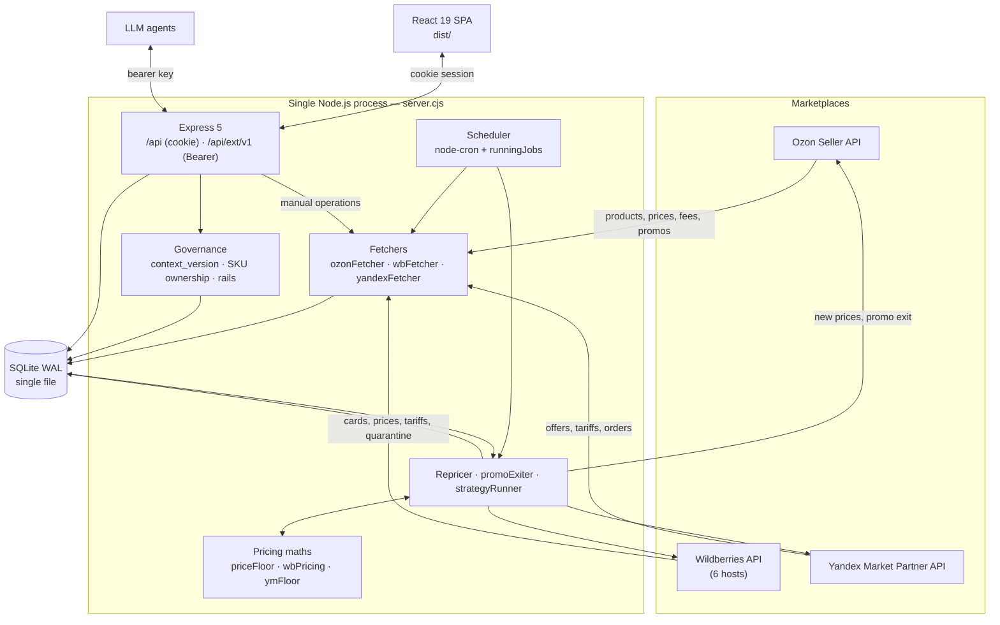

# Architecture

This document is for a developer who is about to change something. It describes how the system actually works, not how it ought to. Every claim here was checked against the code; where the code does not say, this document says so.

For end-user workflows see the [User Guide](user-guide.md). For the machine API see the [External API](api-external.md). For the pricing search see [Strategies](strategies.md).

---

## 1. The shape of the system

The whole thing is **one Node.js process**. The HTTP server (Express 5) and the scheduler (node-cron) share that process and its memory: `server.cjs` starts Express and calls `scheduler.startScheduler()` from the `listen()` callback. There is no message broker, no worker pool, no separate cron container. All state lives in a single SQLite file in WAL mode.

That is a deliberate trade: one command to deploy, no horizontal scaling. **Never run a second instance against the same database** — the guard against concurrent jobs lives in process memory, not in the database (see below).



### Race protection: `runningJobs`

`scheduler.cjs` declares a module-level `const runningJobs = new Set()`. A key goes in before a job starts and comes out in `finally`:

| Key | Job |
|---|---|
| `sync-<store_id>` | store synchronisation |
| `repricer-<store_id>` | repricer run |
| `promoexit-<store_id>` | automatic promotion exit |
| `monitor-<store_id>` | status monitor (Ozon only) |
| `verifier` | price verification (global) |
| `executor` | scheduled updates (global) |

Two consequences worth remembering before you touch this file:

1. **The set is in memory.** A restart wipes it, and two processes on one database cannot see each other's keys — they will push prices simultaneously.
2. **There is exactly one cross-job lock**: `promoexit-<id>` will not start while `repricer-<id>` for the same store is busy. Both write prices, so running them together would be a genuine race ("PromoExit for … postponed — repricer is running"). No other pair of jobs is guarded this way.

---

## 2. Middleware order in `server.cjs`

The order is load-bearing. Get it wrong and either login stops working or the machine API disappears behind cookie auth.

```
1.  FORCE_PUBLIC_DNS (before everything) — patches dns.lookup when enabled
2.  require('./sentry.server.cjs')       — before express and the scheduler
3.  cors({ origin: allowlist, credentials: true })
4.  app.all('/api/auth/{*path}', toNodeHandler(auth))
5.  express.json({ limit: '10mb' })
6.  request logger (>1s, plus every 4xx/5xx)
7.  app.use('/api/ext/v1', rateLimit, requireApiKey, audit, external)
8.  app.use('/api/...', requireAuth, requirePermission('repricer'), ...)
9.  Sentry.setupExpressErrorHandler(app)
10. global error handler
11. express.static('dist') + SPA catch-all app.get('/{*path}')
```

Why it is like that:

- **`FORCE_PUBLIC_DNS` is the first statement in the file**, before any `require` that might open a socket. It replaces `dns.lookup` with `dns.resolve4` against 8.8.8.8 / 1.1.1.1. It defaults to off because it changes name resolution for the entire process — that is the host owner's call, not a library's.
- **Sentry before Express and the scheduler**, otherwise the http and `unhandledRejection` hooks are attached to objects that already exist and some errors are lost.
- **better-auth before `express.json()`** — required by better-auth itself. Its Node handler reads the request body from the stream. If `express.json()` consumes the stream first, the handler is left with nothing and login fails. This is the number-one cause of "login silently does nothing" after someone tidies up the middleware list.
- **`/api/ext/v1` before the cookie-protected `/api` mounts.** Express 5 matches `app.use('/api', requireAuth, …)` by prefix, so an external API mounted later would be swallowed by `requireAuth` and answer `401` instead of checking the bearer key. Order inside the block matters too: `rateLimit` → `requireApiKey` → audit → routes, so the rate limit applies before key verification (brute-forcing a key should stay cheap for the server), and the audit row is written from `res.on('finish')` for non-GET requests only.
- **CORS with an explicit allowlist**: `TRUSTED_ORIGINS`, else `BETTER_AUTH_URL`, else `http://localhost:$PORT`. Reflecting an arbitrary `Origin` together with `credentials: true` would let any website ride along on the user's session cookie. Requests with no `Origin` at all (curl, agents) are allowed through.
- **The SPA catch-all goes last**, or it would eat `/api/*`.

Authorisation is two-stage: `requireAuth` resolves the better-auth session into `req.user`, and `requirePermission('repricer')` checks `user.role` — `admin` always passes, otherwise the role string is parsed as a comma-separated permission list. `/api/docs` requires authentication only.

---

## 3. Layers

```
server.cjs
  └─ routes/*.cjs        HTTP: parsing, validation, status codes
       └─ db/*.cjs       data access: SQL, transactions, aggregates
       └─ lib/*.cjs      pure logic: maths, API clients, parsers
  └─ scheduler.cjs
       └─ *Fetcher.cjs, repricer.cjs, promoExiter.cjs, strategyRunner.cjs
```

- **`routes/`** — 12 routers holding almost no business logic. `wrap` (`middleware/asyncHandler.cjs`) forwards async errors to the global handler; `validateId` (`middleware/validate.cjs`) checks path parameters.
- **`db/`** — 14 modules collapsed into one facade: `db/index.cjs` spreads them into a single object (`{...require('./stores.cjs'), ...}`) and the root `db.cjs` is a one-line re-export. Hence the convention `const db = require('./db.cjs')` and flat calls like `db.getStoreById(...)`. The side effect: **every function in every `db/` module shares one flat namespace** — when adding a function, make sure the name is free, or the later module in the list will silently shadow the earlier one.
- **`lib/`** — everything that knows nothing about HTTP or the database: the three pricing models, the strategy engine, Bayesian demand estimation, the spreadsheet parser, HTTP client factories, S3 backup, API diagnostics. This is the tested part of the system (see §9).
- **`db/connection.cjs`** is the only place that opens a better-sqlite3 connection. `auth.mjs` imports the same connection through `createRequire`, so better-auth and the app never drive two handles into one file.

### Fetchers and the platform-agnostic dispatcher

| File | Marketplace | Notes |
|---|---|---|
| `ozonFetcher.cjs` (848 lines) | Ozon | products, prices, stocks, visibility, promotions, auto-enrolment opt-out |
| `wbFetcher.cjs` (463) | Wildberries | cards, price/discount pairs, quarantine, commissions, box tariffs, stocks via async report |
| `yandexFetcher.cjs` (812) | Yandex Market | offers, prices, `tariffs/calculate`, orders, quarantine |

One function in `scheduler.cjs` picks between them:

```js
function getFetcher(platform) {
    if (platform === 'yandex') return require('./yandexFetcher.cjs');
    if (platform === 'wildberries') return require('./wbFetcher.cjs');
    return ozonFetcher;
}
```

Dispatch is driven by the `stores.platform` column (`'ozon' | 'wildberries' | 'yandex'`, defaulting to `'ozon'`). The shared contract is `syncStore(storeId)`. Price submission is **not** fully unified: Ozon and WB implement `updateProductPrices(...)`, while Yandex is called as `updatePrices(campaignId, apiKey, …)` with a different signature, which is why `scheduler.cjs` and `routes/external.cjs` still contain explicit `if (platform === 'yandex')` branches. That asymmetry is not an accident — Yandex credentials belong to a campaign, not to a seller account.

The logic above the fetchers branches too, but in large blocks: for Wildberries, `repricer.checkStore()` hands off immediately to `enforceWbRepricing()` (hold the reference price by moving the base price behind a fixed discount), and for Yandex to `enforceYandexFloor()`.

---

## 4. Database schema

A single SQLite file (`DB_PATH`, default `./ozon.db`) with `journal_mode = WAL`, `synchronous = NORMAL`, `foreign_keys = ON`. The driver is better-sqlite3, which is **synchronous**: queries do not yield to the event loop, so a slow query blocks HTTP handling for the whole process.

### Tables

| Table | Purpose |
|---|---|
| `stores` | Stores: name, platform, all credentials (`client_id`/`api_key` for Ozon, `ym_business_id`/`ym_campaign_id`/`ym_api_key`, `wb_api_key`), sync/repricer/monitor intervals, deviation thresholds, `tax_rate`, `min_margin_percent`, promo-guard and promo-exit flags with an allowed-promotions whitelist, `strategy_kill_switch`. Primary key is a UUID (TEXT). |
| `products` | Products of a store. `ozon_id` is the marketplace's numeric id (for WB it holds **nmID**), `offer_id` is the seller SKU (for WB, **vendorCode**). Also the reference `ref_price`/`ref_min_price`, `cost_price`, the computed `floor_min_price`, statuses (`visibility`, `is_quarantine`, `in_promo`, `promo_price`, FBO/FBS stock), WB specifics (`wb_subject_id`, `wb_volume_liters`, `wb_price_base`, `wb_discount`), strategy fields (`strategy_type`, `in_experiment`, price corridor) and governance fields (`management_mode`, `managed_by`, `freeze_reason`). Unique on `(store_id, ozon_id)`. |
| `price_history` | Price history per product: `price`, `marketing_price`, `min_price`, timestamped. |
| `sync_logs` | Run header (sync, repricer, monitor): status, counters, start/finish. |
| `sync_log_entries` | Line-by-line run journal: `level`, `stage`, `message` — what the log modal shows. |
| `price_imports` | Uploaded price spreadsheets: path, status, result JSON. Old files are pruned (three most recent per store). |
| `price_updates_pending` | Prices sent and awaiting verification: `sent_price`, `verify_after`, `status` (`PENDING` → `VERIFIED_OK` / `VERIFIED_FAIL` / expired). |
| `price_snapshots` | Snapshot of prices taken before a bulk operation — the basis for rollback. Plus `category` and `comment`. |
| `scheduled_updates` | Deferred price changes: `scheduled_at`, `updates_json`, `status` (`SCHEDULED` → `EXECUTED`/`ERROR`). |
| `api_logs` | Every marketplace API call: endpoint, status, duration, batch size, source (`sync`/`repricer`/`monitor`/…), retry number, error body. The input for the degradation detector. |
| `repricer_log` | Per-SKU repricer decisions: `action` (`ok`, `corrected`, `skipped_promo`, `skipped_quarantine`, `skipped_below_cost`, `skipped_bad_ref`, …), old/new/reference price, deviation, reason. |
| `app_settings` | Key-value settings: `context_version`, `policy_*`, the global strategy kill-switch, Performance API credentials (`perf_api_<store_id>`), the external API runtime switch. |
| `external_api_log` | Audit of external API mutations: IP, method, path, status, store, action, affected SKU count. |
| `sales_daily` | Sales mart: one row per `(store, offer_id, date)` — units, revenue, profit, price, unit cost, commission, floor, promo flag, ad spend, stock, a "dirty day" flag and posterior λ estimates. Fuel for the pricing strategies. |
| `experiments` | Per-SKU experiment state: strategy type, current price, step, direction, best point, bad-step counter, `auto_apply`. Unique on `(store_id, offer_id)`. |
| `strategy_log` | Strategy engine decisions: action, old/new price, metric, reason, whether it was applied. |
| `agent_decisions` | Agent decisions, intents and policies (`kind`: `decision` \| `intent` \| `policy`) with a scope (one store or all) and an expiry. |
| `agent_acks` | Which agent acknowledged which `context_version`. |

The better-auth tables (`user`, `session`, `account`, `verification`) are **not** part of this schema — better-auth creates them itself: `auth.mjs` calls `getMigrations(auth.options)` and `runMigrations()` against the same database file.

Indexes are declared alongside the schema; the hot paths are `sales_daily(store_id, offer_id, date)`, `price_updates_pending(status, verify_after)`, `scheduled_updates(status, scheduled_at)`, `api_logs(store_id, timestamp)` and `products(store_id, visibility|is_quarantine|in_promo)`.

### How migrations work

**There is no schema version table.** No `schema_version`, no migration files, no `migrate` command. Instead, `db/connection.cjs` runs the following at module load — that is, on every process start:

1. `initSchema()` — one large `CREATE TABLE IF NOT EXISTS …` block plus `CREATE INDEX IF NOT EXISTS …`.
2. `runMigrations()` — a list of required columns, each added through `alterSafe()`:

```js
function alterSafe(sql, colName) {
    try { db.prepare(sql).run(); }
    catch (err) {
        if (!err.message.includes('duplicate column name')) { … }
    }
}
```

`ALTER TABLE … ADD COLUMN` always runs and the "column already exists" error is swallowed. The migration is idempotent by construction, ordering is array ordering, and there is no `down`.

The rule when extending it: **add a new column to the `storeColumns` / `productColumns` array, not to `initSchema()`** — `CREATE TABLE IF NOT EXISTS` will not touch a table that already exists, so on a live database the column would never appear. New tables and indexes introduced after the first release go through `execSafe(CREATE TABLE IF NOT EXISTS …)` inside `runMigrations()` — that is how `agent_acks` and `agent_decisions` were added.

There are two structural migrations, both guarded and both executed with `foreign_keys = OFF` inside a transaction:

**A. Repair of `stores_old` references.** The guard is a `sqlite_master` query:

```sql
SELECT name, sql FROM sqlite_master WHERE type='table' AND sql LIKE '%stores_old%'
```

No matches, nothing happens. Otherwise each affected table is recreated under a temporary name with the corrected DDL, data is copied across, the old table is dropped and the temporary one renamed.

**B. `stores.id` from INTEGER to UUID.** The guard is the storage class of the first row:

```sql
SELECT typeof(id) as t FROM stores LIMIT 1
```

Only when `t === 'integer'` does `migrateStoresToUUID()` run: the table is rebuilt with `id TEXT PRIMARY KEY` (other columns reconstructed from `PRAGMA table_info`), every store gets a `crypto.randomUUID()`, and `store_id` is rewritten in every child table (`products`, `sync_logs`, `price_imports`, `price_updates_pending`, `price_snapshots`, `scheduled_updates`, `api_logs`, `repricer_log`).

A subtlety in the ordering: migration B uses `ALTER TABLE stores RENAME TO stores_old`, and SQLite rewrites child-table foreign keys to point at `stores_old` when it does. Migration A is what cleans that up — but it sits **above** B in the code, so it repairs the damage on the **next** boot, not the same one. On a fresh install neither branch ever fires.

---

## 5. The scheduler

`scheduler.cjs` registers four cron tasks and one one-shot call at startup.

| Schedule | What runs | Why |
|---|---|---|
| `* * * * *` (every minute) | The main tick: walks every store and starts whatever is due | The single heartbeat of the system. Per-store intervals are not cron expressions but `now − last_run > interval` comparisons against store columns |
| `0 <BACKUP_HOUR> * * *` (default 03:00) | `runBackup(rawDb)` — dumps the database to S3-compatible storage | Backup before the morning jobs; disabled when the S3 variables are empty |
| `0 4 * * *` | Per store: `salesCollector.collectStoreSales(id, {days: 2})`, then `strategyRunner.runStore(id)` | Collect yesterday's sales into `sales_daily` first, then make pricing decisions on them. The two-day window leaves room for late marketplace reporting |
| `10 * * * *` (hourly, at :10) | `getDegradations(store.id)` for every non-Yandex store, alerting to Sentry | Detects endpoint degradation **from accumulated `api_logs`**, without a single marketplace request — the repricer's own traffic already carries the statistics |
| once at startup | `db.expireOldPending(3)` | Clears stale price verifications (for example on stores where verification is impossible) |

Inside the main tick, in order:

1. **Sync** — when `now − last_updated_at > update_interval_minutes`, `getFetcher(platform).syncStore(id)` runs under the `sync-<id>` key, fire-and-forget with `.catch()` and `.finally()`.
2. **Repricer** — when `repricer_enabled` is set and `now − last_repricer_run > repricer_interval_min` (default 15 minutes), `repricer.checkStore(id)` runs.
3. **Promotion exit** — the interval is the constant `PROMO_EXIT_INTERVAL_MIN = 5`. Ozon uses `promoExiter` (deactivate participation plus set the auto-enrolment opt-out flag); Wildberries uses `wbPromoExiter`, which restores the price/discount pair because WB has no exit-from-promotion endpoint at all. The job is postponed while `repricer-<id>` holds the same store.
4. **Status monitor** (`runStatusMonitor`) — Ozon only (`yandex` and `wildberries` are skipped; WB visibility and quarantine are refreshed inside `syncStore`). The interval is `monitor_interval_min`, default 30. It refreshes visibility, quarantine/archive/stock flags, clears and re-applies promo flags, and — if `promo_guard_enabled` is on **and** `promo_exit_enabled` is off — calls `promoGuard.checkStore()`. Running both would send duplicate `deactivate` calls.
5. **Verifier** (`runVerifier`) — picks up `price_updates_pending` rows whose `verify_after` (set to send time + 3 minutes) has passed, groups them by store, reads the live prices via `/v5/product/info/prices` in chunks of 1000 `offer_id`s and marks `VERIFIED_OK` when the difference is within 1% of the sent price, otherwise `VERIFIED_FAIL` with the discrepancy spelled out. Yandex and WB stores are skipped: WB applies prices asynchronously through tasks, and control there runs through the quarantine check in `syncStore`.
6. **Scheduled executor** (`runScheduledExecutor`) — takes due `scheduled_updates`, parses `updates_json` (malformed JSON → status `ERROR` with a snippet in the log), sends the prices, creates `price_updates_pending` rows and writes the final status.
7. **Data rotation** — `maybeRotateOldData()` with a home-made "once a day" based on an in-memory `lastRotation`, so a restart makes rotation happen on the very next tick.

`stopScheduler()` stops all four tasks; `server.cjs` calls it from `gracefulShutdown` on `SIGTERM`/`SIGINT`, then closes the HTTP server and the database, and force-exits if that takes longer than 25 seconds.

---

## 6. Three pricing models

There is deliberately no single formula with a platform flag. The economics differ enough that a shared formula would be wrong for at least one marketplace.

### Ozon — `lib/priceFloor.cjs`

```
floor = ⌈ ( cost·(1 + margin%) / (1 − tax%) + logistics + acquiring ) / (1 − commission%) ⌉
```

The inputs come from the live `/v5/product/info/prices` response: commission is `sales_percent_fbo` falling back to `sales_percent_fbs`, logistics is `fbo_direct_flow_trans_min_amount` (or its FBS equivalent), acquiring is the `acquiring` field.

The function returns `null` — meaning "no floor" — when the unit cost is ≤ 0, **when `tax_rate` is not strictly inside (0, 100)**, or when the commission is not inside (0, 100). The practical consequence: **on an Ozon store with `tax_rate = 0` the floor protection does not run at all**, and the Ozon branch in `repricer.cjs` is additionally wrapped in `if (store.tax_rate > 0)`.

### Wildberries — `lib/wbPricing.cjs`

```
floor = ⌈ ( cost·(1 + margin%) / (1 − tax%) + logistics + returnLogistics ) / (1 − (commission% + acquiring%)) ⌉
```

Differences from Ozon:

- Acquiring is a **percentage** here (1.5% by default) and joins the commission in the denominator instead of being added as a currency amount in the numerator.
- **`tax = 0` means a rate of 0%, not "disabled"** — the guard still applies even when the seller never entered a rate. The function comment says so explicitly.
- Logistics is derived from box volume: `computeBoxLogistics(V, tariff) = base + max(0, ⌈V⌉ − 1) · liter`, with the volume taken from the card's dimensions (cm³ → litres). Return logistics is booked as `logistics · (1 − buyoutShare)`, and the buyout share is hard-coded as `0.7` in `repricer.cjs`.
- The commission is category-based, looked up by `wb_subject_id` (FBO tariff).

Separately from the floor, WB poses a "how do you even set a price" problem: the buyer sees `discountedPrice = price · (1 − discount/100)` and the API takes the pair. `computeWbPricePair(target, currentDiscount)` **keeps the seller discount** — it doubles as an anchor and as a signal for a higher platform-funded discount — and moves the base price instead: `base = ⌈target / (1 − discount/100)⌉`. Rounding up guarantees the seller price never lands below the target, and therefore never below the floor. If the discount is outside 1…99, the pair degenerates to `{price: target, discount: 0}`.

### Yandex Market — `lib/ymFloor.cjs`

```
floor = ⌈ ( cost·(1 + margin%) + absFees ) / (1 − (pctFees% + tax% + boost%)) ⌉
```

Here **every deduction proportional to the sale price lives in one denominator**: percentage fees from `tariffs/calculate` (category commission, payment acceptance and transfer, delivery to the buyer), tax, and the boost rate. Fixed deductions (middle mile, sorting) go into the numerator as currency amounts.

Why this is a different model and not the same one with different coefficients:

- **Tax is charged on gross revenue, not on net after fees.** The simplified "income" tax regime applies to the whole sale amount. In the Ozon and WB formulas the tax is nested in the numerator (`cost/(1 − tax)`), i.e. treated as tax on the net amount the seller wants to keep. The comment in `ymFloor.cjs` calls the difference intentional and states that the previous, Ozon-shaped formula in the Yandex branch was a bug.
- **No tariff endpoint returns the boost rate.** It has to be reconstructed from actuals — from `stats/orders` (`bidFee`) — and added to the same denominator.
- There is a safety catch: if the proportional deductions add up to `ANOMALY_PERCENT` (95%) or more, the function returns `null`. The denominator would be near zero, and a broken category feed would send the floor to infinity.

Alongside it sits `computeYmSellerPayout(...)`, the actual payout for a specific sale. It subtracts fees **explicitly** rather than through a denominator, and exists to detect real losses (the `YM_SOLD_BELOW_FLOOR` metric). Its result can be negative.

### Master price

`lib/masterPricing.cjs` expands a single buyer-facing price into each platform's rules:

- **Ozon / Yandex**: `price = master`; `min_price` is the configured `ref_min_price` or `master · 0.5`; `old_price = computeOldPrice(price, min_price)` = `max(⌈price·1.25⌉, ⌈min_price·2⌉, price + 1)`, satisfying both Ozon constraints at once — the struck-through price must exceed the current price and must be at least twice `min_price`.
- **Wildberries**: a `{price, discount}` pair from `computeWbPricePair`, so that `discountedPrice` equals the master price.

---

## 7. The governance layer

`db/governance.cjs` (234 lines) solves a problem an ordinary repricer does not have: **several LLM agents, in several separate chats, managing the same catalogue**, each with an incomplete picture. That is a concurrency problem, and it is solved as one.

### The analogy: optimistic locking (ETag / If-Match)

In HTTP a client reads a resource, gets an `ETag`, and sends `If-Match: <etag>` when writing. If the resource changed in between, the server answers `412 Precondition Failed` and the client has to re-read.

This is the same scheme, except the version covers **the entire field of knowledge**, not one document:

| HTTP | Repricer |
|---|---|
| `GET /resource` → `ETag: "42"` | `GET /context` → `context_version: 42` |
| `PUT` + `If-Match: "42"` | `POST /stores/:id/prices` + `context_version: 42` |
| `412 Precondition Failed` | `409 context_stale` — **with the delta of changes in the same response** |
| a write without `If-Match` is allowed | a write without a version is rejected: `428 context_version_required` |

Two departures from the classic ETag are deliberate. First, `409` returns not just the current version number but the delta of what changed, so an agent usually needs no second round-trip to learn what it missed. The full context used to travel in that same response, which on a catalogue with hundreds of managed SKUs cost tens of thousands of tokens per collision. Second, a missing version is an **error**, not permission to write: a forgotten field must never move real prices.

The version is a counter in `app_settings.context_version`, incremented by `bumpContextVersion()` whenever shared knowledge changes — a new journal entry, a closed decision, a change of SKU management mode.

### The four layers

1. **Versioned context.** `getContext()` returns `context_version`, the active policies, a map of managed SKUs (`platform:store:offer_id` → mode, owner, reason, held price), active decisions, the acknowledgement list, and a textual `contract` summarising the rules for the agent.

2. **SKU ownership.** `products.management_mode` ∈ `ref_price | experiment | liquidation | disposal`, plus `managed_by`.
   - `ref_price` — ordinary mode: the repricer holds the price and external agents may write with validation;
   - `experiment` / `liquidation` — **only the owner** (`managed_by`) may write; anyone else gets `sku_owned`. The exception is `agent: 'user'`, i.e. a human;
   - `disposal` — the item is out of circulation and **any** price write is rejected (`sku_disposal`); `repricer.cjs` skips those SKUs as well.

3. **Decision journal** — `agent_decisions` holds three kinds of record: `decision` (taken), `intent` (announced in advance) and `policy` (a rule). Each carries a scope: one store or all stores — because the same `offer_id` can be profitable in one store and under liquidation in another.

4. **Policy rails** (`validatePriceUpdates`) — the checks that stop confident nonsense before it reaches a marketplace:
   - `policy_price_change_max_pct` (default 15) — maximum deviation from the reference per write; `liquidation` is exempt;
   - `policy_mass_change_limit` (200) — more SKUs in one request requires `confirm_mass: true`;
   - `policy_require_floor` (`true`) — a SKU with no computed floor is rejected with `no_floor`. This closes the cheapest route into a loss: an item without a unit cost used to pass any price silently;
   - a price below `floor_min_price` → `below_floor`.

   The result is not all-or-nothing: the function returns `{accepted, rejected}`, and every rejected line carries a code and a human-readable reason.

Policies live in `app_settings` under `policy_*` keys and can be changed without touching code. Two of them are not numbers at all but sentences — about co-investment and the tax base — which travel into the context and the briefing so that an agent computes profit by reading `GET /stores/:id/pnl` instead of inventing its own arithmetic.

### Briefing and acknowledgement

`getBriefing()` assembles a **Markdown document on the fly** from the decision journal and SKU state: active decisions with their scope, a per-store summary of SKUs by mode, the current limits and the current `context_version`. `POST /briefing/ack {agent}` records which version an agent has read into `agent_acks` (`ON CONFLICT DO UPDATE`, one row per agent). `listAcks()` flags each row with `up_to_date` against the current version, so it is visible at a glance who is behind.

---

## 8. Marketplace quirks and hard-won rules

Collected from comments in the code. Nearly every item was written after an incident.

### Wildberries

- **A single process-wide throttle.** WB enforces a strict per-seller limit, so `lib/wbClient.cjs` keeps one queue for the entire process (`globalChain`, `MIN_REQUEST_INTERVAL_MS = 1200`, roughly 5 requests per 6 seconds with headroom). Per-client queues would not help: sync, repricer and promo exit each create their own client and together would burst into `429`. Retries go up to three times, waiting for `X-Ratelimit-Retry` when present and backing off exponentially otherwise.
- **There is no single `baseURL`.** Six hosts by method group (`content`, `prices`, `calendar`, `common`, `analytics`, `statistics`); the client is created without a base URL and the fetcher assembles full URLs.
- **Do not add a custom IPv4 agent.** The comment records that a custom `keepAlive` agent hung sockets on `discounts-prices-api`; WB hosts publish no AAAA records and the default resolver handles them fine.
- **Quarantine on a sharp price drop.** WB quarantines an item when the price falls by roughly 1.5×–3×, and the new price simply is not applied. `repricer.cjs` therefore steps down: `QUAR_RATIO = 1.5`, and if the target is more than 1.5× below the current price, this run only lowers it to `⌈current / 1.45⌉` (`QUAR_STEP = QUAR_RATIO − 0.05`, to avoid sitting exactly on the threshold). Later runs finish the job. In parallel, `fetchQuarantine()` reads `/api/v2/quarantine/goods` and writes a warning into the sync log.
- **Prices are applied asynchronously.** WB returns a `taskId`; the outcome is checked through quarantine and a re-read of prices in `syncStore`, not by the verifier.
- **Excel import does not push prices to WB.** The import only records the reference price and unit cost; sending is the repricer's job, because a direct push would break the `price`/`discount` pair and could land the item in quarantine.
- **A removed stocks endpoint.** `statistics-api /api/v1/supplier/stocks` returns 404 as of 08.2026; stocks now come from the asynchronous `warehouse_remains` report (create → poll status every 10 s for up to 150 s → download).
- **Numbers may arrive as strings with a comma** (`"0,5"`), which is what `parseNum` in the fetcher is for.

### Yandex Market

- **Forced IPv4.** On the host where this was written `dns.lookup` returned IPv6 only, so `lib/yandexClient.cjs` installs a custom lookup over `dns.resolve4` with five retries 200 ms apart — Yandex `ENODATA` responses are often transient.
- **`discountBase` must be sent with every price write** and must stay valid: the discount derived from it has to fall within 5–99%. Hence `baseFor(value)`: keep the existing base if it is ≥ `⌈value·1.06⌉`, otherwise use `⌈value·1.25⌉`.
- **An empty response is indistinguishable from an error.** The quarantine reader says so directly: an empty `Set` produced by an exception looks exactly like "quarantine is empty" — the pattern behind the 405 incident — so the result is returned together with an error flag.
- **Credentials belong to a campaign**, not a store: `ym_business_id` + `ym_campaign_id` + `ym_api_key`, which is why `updatePrices` has a different signature from Ozon and WB.
- **The Yandex floor always runs**, even at `tax_rate = 0` — it emits a warning rather than skipping silently, unlike the Ozon branch.

### Ozon

- **`min_price` must be at least 50% of the price.** Otherwise the platform rejects **the entire item update** with `min_auto_price_too_small` and the price is not restored. In the repricer: if the fetched `min_price` is above zero but below `refPrice · 0.5`, it is raised to `⌈refPrice · 0.5⌉`.
- **`old_price` satisfies two constraints at once** — greater than `price` and at least `2 × min_price` (`computeOldPrice`).
- **HTTP 200 with errors inside.** Ozon answers 200 to `/v1/product/import/prices` while per-item rejections sit in `result[].errors`. They are parsed out into `data._itemErrors`, written to `api_logs` (which survives docker log rotation and is visible in the UI) and reported to Sentry as a warning. Counting such a response as success is the easiest way to "apply" a price that does not exist.
- **The filter caps at 1000 entries.** `Filters.OfferIds` on `/v5/product/info/prices` is chunked by 1000 in both the verifier and the repricer.
- **429 → exponential backoff** (`1000 · 2^attempt`, up to three attempts).
- **Verification after 3 minutes with a 1% tolerance** — anything tighter would produce false `VERIFIED_FAIL`s from platform-side rounding.
- **Advertising is a separate world.** The Performance API uses different credentials and a different host (`api-performance.ozon.ru`; `performance.ozon.ru` is deprecated); the `client_credentials` token lives 30 minutes and is cached. Credentials are stored in `app_settings` under `perf_api_<store_id>`.

### Infrastructure

- **`COPY *.cjs ./` in the Dockerfile is a deliberate wholesale copy.** The comment is explicit: do not list the files one by one, or a new root-level module will silently miss the image and fail at runtime with `MODULE_NOT_FOUND`.
- **`py3-setuptools` in both stages.** Python 3.12 dropped `distutils`, which the old node-gyp bundled with better-sqlite3 still imports; setuptools' vendored copy patches it back in.
- **Source maps are deleted from `dist`.** The build uses `sourcemap: 'hidden'`, so the bundle carries no `//# sourceMappingURL=`, but `.map` files are still emitted — the Dockerfile removes them with `find dist -name '*.map' -delete`.
- **`FORCE_PUBLIC_DNS=1`** is the escape hatch for hosts whose resolver cannot reach marketplace APIs — classically Docker's internal DNS proxy at 127.0.0.11, which resolves some Ozon and Yandex domains inconsistently. Off by default, because it reroutes **every** lookup the process makes.

---

## 9. Testing

141 tests, run with `npm test` (Vitest, jsdom environment, `passWithNoTests: true`).

### What is covered

| File | Tests | Subject |
|---|---|---|
| `db/__tests__/cockpit.test.mjs` | 22 | cockpit queries: alert types, money at risk, aggregates |
| `src/utils/__tests__/formulaParser.test.ts` | 16 | the bulk-edit formula parser |
| `lib/__tests__/strategyEngine.test.mjs` | 15 | strategy engine: steps, hysteresis, rollbacks, convergence |
| `src/components/products/__tests__/StatusBadge.test.ts` | 12 | product status rendering |
| `lib/__tests__/wbPricing.test.mjs` | 11 | WB floor, box logistics, price/discount pair |
| `lib/__tests__/ymFloor.test.mjs` | 10 | Yandex floor, the ≥95% anomaly guard, seller payout |
| `src/components/dashboard/__tests__/CockpitCharts.test.tsx` | 10 | cockpit charts |
| `lib/__tests__/apiKeyAuth.test.mjs` | 8 | external API: key check, constant-time comparison, IP allowlist, rate limit |
| `lib/__tests__/masterPricing.test.mjs` | 8 | deriving platform prices from a master price |
| `src/components/dashboard/__tests__/TaskCard.test.tsx` | 7 | the task card |
| `src/components/ui/__tests__/Modal.test.tsx` | 6 | the modal |
| `lib/__tests__/bayesPoisson.test.mjs` | 5 | Gamma-Poisson posterior and quantiles |
| `lib/__tests__/excelParser.test.mjs` | 4 | number parsing ("1 300,50", NBSP), regex column matching |
| `lib/__tests__/strategyConvergence.test.mjs` | 4 | ladder convergence to the optimum |
| `db/__tests__/pending-fk.test.mjs` | 3 | foreign-key integrity of pending verifications |

The coverage logic is coherent: **everything that can quietly lose money is tested** — the pricing maths, the strategy engine, the input parser, external API authentication and the queries the alerts are built on. All of it is pure functions with no network, so the tests are fast and deterministic. `lib/priceFloor.cjs` (Ozon) has **no test of its own** — the only one of the three pricing models without direct coverage.

There is also `scripts/simStrategy.cjs`, a Monte-Carlo simulation of the strategy engine against a known optimum on synthetic linear demand. It is a validation tool rather than a unit test and is run by hand.

### What is not covered

- **The fetchers** (`ozonFetcher`, `wbFetcher`, `yandexFetcher`, ~2100 lines) have no tests at all: they are network-bound and the repository contains no marketplace mocks.
- **The routes** — the HTTP layer is untested; supertest is not among the dependencies.
- **The scheduler** — neither the schedules, nor `runningJobs`, nor the "postpone promo exit while the repricer runs" rule.
- **Governance** (`db/governance.cjs`) — context versioning, SKU ownership and the policy rails are **untested**, even though this is pure, branch-heavy, easily testable logic. It is the most conspicuous gap.
- **`repricer.cjs`** as a whole (855 lines) — only the `lib/` functions it calls are covered.
- **Migrations** — neither `alterSafe` idempotency nor either structural migration is checked automatically.

---

## Related documents

- [Installation](installation.md)
- [User Guide](user-guide.md)
- [External API](api-external.md)
- [LLM Agent Instructions](llm-agent.md)
- [Pricing Strategies](strategies.md)
