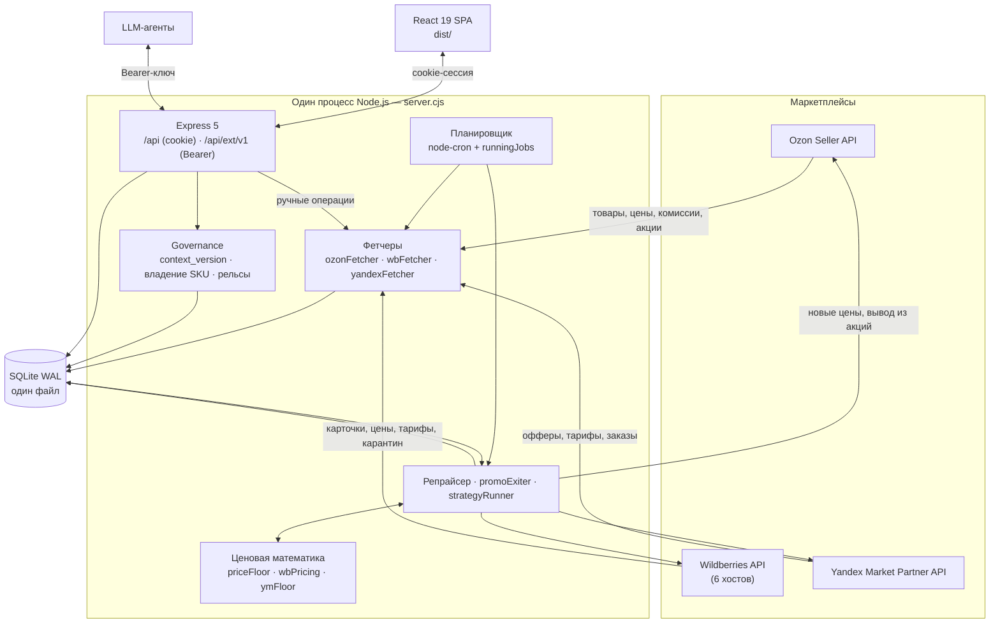

# Архитектура

Документ для разработчика, который собирается что-то менять в коде. Он описывает, как система устроена на самом деле — не как «должна быть». Все утверждения проверены по коду; там, где в коде данных нет, так и написано.

Пользовательские сценарии — в [Руководстве пользователя](user-guide.md). Внешний API — в [Внешнем API](api-external.md). Ценовые стратегии — в [Стратегиях](strategies.md).

---

## 1. Общая схема

Вся система — **один процесс Node.js**. HTTP-сервер (Express 5) и планировщик (node-cron) живут в одном процессе и в одной памяти: `server.cjs` поднимает Express и в колбэке `listen()` вызывает `scheduler.startScheduler()`. Нет брокера очередей, нет воркеров, нет отдельного крон-контейнера. Состояние — один файл SQLite в режиме WAL.

Это осознанный размен: развернуть можно одной командой, но горизонтально не масштабируется. **Второй экземпляр процесса на той же базе запускать нельзя** — защита от параллельных прогонов держится в памяти процесса, а не в БД (см. ниже).



### Защита от гонок: `runningJobs`

В `scheduler.cjs` объявлен модульный `const runningJobs = new Set()`. Перед запуском задачи в множество кладётся ключ, в `finally` — удаляется. Ключи:

| Ключ | Задача |
|---|---|
| `sync-<store_id>` | синхронизация магазина |
| `repricer-<store_id>` | прогон репрайсера |
| `promoexit-<store_id>` | автовывод из акций |
| `monitor-<store_id>` | монитор статусов (только Ozon) |
| `verifier` | проверка применённых цен (глобальный) |
| `executor` | исполнение отложенных обновлений (глобальный) |

Два следствия, о которых надо помнить при правках:

1. **Множество живёт в памяти.** Перезапуск процесса стирает его; два процесса на одной базе не увидят чужих ключей и пошлют цены одновременно.
2. **Есть явная межзадачная блокировка**: `promoexit-<id>` не стартует, если занят `repricer-<id>` того же магазина, — обе задачи пишут цены, и конкурентная запись дала бы гонку («PromoExit for … postponed — repricer is running»). Остальные пары задач такой проверки не имеют.

---

## 2. Порядок middleware в `server.cjs`

Порядок здесь не косметический — от него зависит, работает ли вход и не перехватывается ли машинный API cookie-защитой.

```
1.  FORCE_PUBLIC_DNS (до всего)      — патч dns.lookup, если включён
2.  require('./sentry.server.cjs')   — до express/scheduler
3.  cors({ origin: allowlist, credentials: true })
4.  app.all('/api/auth/{*path}', toNodeHandler(auth))
5.  express.json({ limit: '10mb' })
6.  логгер запросов (>1s и все 4xx/5xx)
7.  app.use('/api/ext/v1', rateLimit, requireApiKey, audit, external)
8.  app.use('/api/...', requireAuth, requirePermission('repricer'), ...)
9.  Sentry.setupExpressErrorHandler(app)
10. глобальный обработчик ошибок
11. express.static('dist') + SPA catch-all app.get('/{*path}')
```

Почему именно так:

- **`FORCE_PUBLIC_DNS` — первой строкой файла**, до `require` любого модуля, который может открыть сокет. Патч подменяет `dns.lookup` на `dns.resolve4` через 8.8.8.8/1.1.1.1. Переменная выключена по умолчанию: она меняет резолвинг для всего процесса, и это решение владельца хоста, а не библиотеки.
- **Sentry раньше express и планировщика** — иначе хуки http и `unhandledRejection` навешиваются на уже созданные объекты и часть ошибок теряется.
- **better-auth до `express.json()`** — требование самого better-auth: его node-handler читает тело запроса сам, из потока. Если `express.json()` отработает раньше, поток окажется вычитан, и handler зависнет/упадёт на пустом теле. Это самая частая причина «логин молча не работает» при перестановке строк.
- **`/api/ext/v1` до cookie-защищённых `/api`.** Express 5 сопоставляет `app.use('/api', requireAuth, …)` по префиксу, поэтому смонтированный позже внешний API был бы перехвачен `requireAuth` и вернул бы `401` вместо проверки Bearer-ключа. Внутри самого блока порядок тоже значим: `rateLimit` → `requireApiKey` → аудит → роуты, то есть лимит применяется до проверки ключа (перебор ключа стоит дёшево для сервера), а аудит пишется в `res.on('finish')` только для не-GET.
- **CORS с явным allowlist.** `TRUSTED_ORIGINS` (иначе `BETTER_AUTH_URL`, иначе `http://localhost:$PORT`). Отражать произвольный `Origin` вместе с `credentials: true` нельзя — это дало бы любому сайту ездить на сессионной куке пользователя. Запросы без `Origin` (curl, агенты) пропускаются.
- **SPA catch-all в самом конце** — иначе он съел бы `/api/*`.

Права проверяются двухступенчато: `requireAuth` кладёт `req.user` из сессии better-auth, `requirePermission('repricer')` сверяет `user.role`; роль `admin` проходит всегда, иначе роль разбирается как CSV-список разрешений. Эндпоинт `/api/docs` требует только аутентификации.

---

## 3. Слои

```
server.cjs
  └─ routes/*.cjs        HTTP: разбор запроса, валидация, коды ответов
       └─ db/*.cjs       доступ к данным: SQL, транзакции, агрегаты
       └─ lib/*.cjs      чистая логика: математика, клиенты API, парсеры
  └─ scheduler.cjs
       └─ *Fetcher.cjs, repricer.cjs, promoExiter.cjs, strategyRunner.cjs
```

- **`routes/`** — 12 роутеров. Внутри почти нет бизнес-логики: `wrap` (`middleware/asyncHandler.cjs`) прокидывает ошибки async-хендлеров в общий обработчик, `validateId` (`middleware/validate.cjs`) проверяет параметры пути.
- **`db/`** — 14 модулей, собранных в один фасад: `db/index.cjs` разворачивает их в один объект (`{...require('./stores.cjs'), ...}`), а корневой `db.cjs` — однострочный реэкспорт. Поэтому во всём коде принято `const db = require('./db.cjs')` и плоские вызовы `db.getStoreById(...)`. Побочный эффект: **имена функций во всех модулях `db/` живут в одном плоском пространстве имён** — при добавлении функции проверяйте, что имя не занято, иначе последний модуль в списке молча затрёт предыдущий.
- **`lib/`** — то, что не знает ни про HTTP, ни про БД: три ценовые модели, движок стратегий, байесовская оценка спроса, парсер Excel, фабрики HTTP-клиентов, S3-бэкап, диагностика API. Это и есть тестируемая часть системы (см. §9).
- **`db/connection.cjs`** — единственное место, где создаётся соединение better-sqlite3. Его же импортирует `auth.mjs` через `createRequire`, чтобы better-auth и приложение не открывали два драйвера к одному файлу.

### Фетчеры и платформо-агностичный диспетчер

Каждой площадке соответствует свой фетчер:

| Файл | Площадка | Особенности |
|---|---|---|
| `ozonFetcher.cjs` (848 строк) | Ozon | синхронизация товаров/цен/остатков, видимость, акции, самозапрет автодобавления |
| `wbFetcher.cjs` (463) | Wildberries | карточки, цены+скидки, карантин, комиссии, тарифы короба, остатки через асинхронный отчёт |
| `yandexFetcher.cjs` (812) | Яндекс.Маркет | офферы, цены, тарифы (`tariffs/calculate`), заказы, карантин |

Выбор делает одна функция в `scheduler.cjs`:

```js
function getFetcher(platform) {
    if (platform === 'yandex') return require('./yandexFetcher.cjs');
    if (platform === 'wildberries') return require('./wbFetcher.cjs');
    return ozonFetcher;
}
```

Диспетчеризация идёт по колонке `stores.platform` (`'ozon' | 'wildberries' | 'yandex'`, по умолчанию `'ozon'`). Общий контракт фетчера — `syncStore(storeId)`; отправка цен унифицирована **не полностью**: Ozon и WB реализуют `updateProductPrices(...)`, а у Яндекса вызывается `updatePrices(campaignId, apiKey, …)` с другой сигнатурой, поэтому в `scheduler.cjs` и `routes/external.cjs` есть явные ветки `if (platform === 'yandex')`. Это известная асимметрия, а не случайность: у Яндекса ключи привязаны к кампании, а не к магазину.

Логика поверх фетчеров тоже ветвится по платформе, но крупными блоками: `repricer.checkStore()` для Wildberries сразу уходит в отдельную функцию `enforceWbRepricing()` (стратегия «держим РРЦ» через пару цена/скидка), для Яндекса — в `enforceYandexFloor()`.

---

## 4. Схема базы данных

Один файл SQLite (`DB_PATH`, по умолчанию `./ozon.db`), режим `journal_mode = WAL`, `synchronous = NORMAL`, `foreign_keys = ON`. Драйвер — better-sqlite3, **синхронный**: вызовы не уходят в event loop, поэтому долгие запросы блокируют HTTP-обработку всего процесса.

### Таблицы

| Таблица | Назначение |
|---|---|
| `stores` | Магазины: имя, платформа, все креды (`client_id`/`api_key` для Ozon, `ym_business_id`/`ym_campaign_id`/`ym_api_key`, `wb_api_key`), интервалы синка/репрайсера/монитора, пороги отклонений, `tax_rate`, `min_margin_percent`, флаги promo-guard/promo-exit и белый список акций, `strategy_kill_switch`. Первичный ключ — UUID (TEXT). |
| `products` | Товары магазина. `ozon_id` — числовой ID площадки (для WB здесь **nmID**), `offer_id` — артикул продавца (для WB **vendorCode**). Здесь же эталон `ref_price`/`ref_min_price`, `cost_price`, расчётный `floor_min_price`, статусы (`visibility`, `is_quarantine`, `in_promo`, `promo_price`, остатки FBO/FBS), WB-специфика (`wb_subject_id`, `wb_volume_liters`, `wb_price_base`, `wb_discount`), поля стратегий (`strategy_type`, `in_experiment`, коридор цен) и governance (`management_mode`, `managed_by`, `freeze_reason`). Уникальность — `(store_id, ozon_id)`. |
| `price_history` | История цен товара: `price`, `marketing_price`, `min_price` с отметкой времени. |
| `sync_logs` | Шапка прогона (синк, репрайсер, монитор): статус, счётчики, время начала/конца. |
| `sync_log_entries` | Построчный журнал прогона: `level`, `stage`, `message`. Это то, что видно в модалке логов. |
| `price_imports` | Загруженные Excel-файлы с ценами: путь, статус, JSON результата. Старые файлы подчищаются (хранится 3 последних на магазин). |
| `price_updates_pending` | Отправленные цены, ожидающие проверки: `sent_price`, `verify_after`, `status` (`PENDING` → `VERIFIED_OK` / `VERIFIED_FAIL` / протухшие). |
| `price_snapshots` | Снимок цен перед массовой операцией — основа отката. Плюс `category` и `comment`. |
| `scheduled_updates` | Отложенные изменения цен: `scheduled_at`, `updates_json`, `status` (`SCHEDULED` → `EXECUTED`/`ERROR`). |
| `api_logs` | Журнал всех вызовов API площадок: эндпоинт, код, длительность, размер батча, источник (`sync`/`repricer`/`monitor`/…), номер ретрая, тело ошибки. Источник данных для детектора деградаций. |
| `repricer_log` | Построчные решения репрайсера: `action` (`ok`, `corrected`, `skipped_promo`, `skipped_quarantine`, `skipped_below_cost`, `skipped_bad_ref`, …), старая/новая/эталонная цена, отклонение, причина. |
| `app_settings` | Key-value настройки: `context_version`, `policy_*`, глобальный kill-switch стратегий, ключи Performance API (`perf_api_<store_id>`), выключатель внешнего API. |
| `external_api_log` | Аудит мутаций внешнего API: IP, метод, путь, код, магазин, действие, число затронутых SKU. |
| `sales_daily` | Витрина продаж: одна строка на `(магазин, offer_id, дата)` — штуки, выручка, прибыль, цена, себестоимость, комиссия, floor, промо-флаг, реклама, остаток, флаг «грязного» дня и апостериорные оценки λ. Топливо для ценовых стратегий. |
| `experiments` | Состояние ценового эксперимента по SKU: тип стратегии, текущая цена, шаг, направление, лучшая точка, счётчик плохих шагов, `auto_apply`. Уникальность — `(store_id, offer_id)`. |
| `strategy_log` | Журнал решений движка стратегий: действие, старая/новая цена, метрика, причина, применено ли. |
| `agent_decisions` | Журнал решений/намерений/политик агентов (`kind`: `decision` \| `intent` \| `policy`), с охватом (магазин или все) и сроком действия. |
| `agent_acks` | Кто из агентов ознакомился с какой `context_version`. |

Таблицы better-auth (`user`, `session`, `account`, `verification`) в этой схеме не создаются: их создаёт сам better-auth при старте — `auth.mjs` вызывает `getMigrations(auth.options)` и `runMigrations()` в том же файле БД.

Индексы объявлены рядом со схемой: горячие пути — `sales_daily(store_id, offer_id, date)`, `price_updates_pending(status, verify_after)`, `scheduled_updates(status, scheduled_at)`, `api_logs(store_id, timestamp)`, `products(store_id, visibility|is_quarantine|in_promo)`.

### Подход к миграциям

**Таблицы версий схемы нет.** Нет ни `schema_version`, ни файлов миграций, ни команды `migrate`. Вместо этого `db/connection.cjs` при загрузке модуля (то есть при каждом старте процесса) выполняет по очереди:

1. `initSchema()` — один большой `CREATE TABLE IF NOT EXISTS …` + `CREATE INDEX IF NOT EXISTS …`.
2. `runMigrations()` — список нужных колонок, каждая добавляется через `alterSafe()`:

```js
function alterSafe(sql, colName) {
    try { db.prepare(sql).run(); }
    catch (err) {
        if (!err.message.includes('duplicate column name')) { … }
    }
}
```

То есть `ALTER TABLE … ADD COLUMN` выполняется всегда, а ошибка «колонка уже есть» глотается. Миграция идемпотентна по построению, порядок = порядок элементов массива, отката (`down`) не существует.

Правило при доработке: **новую колонку добавляют в массив `storeColumns` / `productColumns`, а не в `initSchema()`** — `CREATE TABLE IF NOT EXISTS` не тронет уже существующую таблицу, и на боевой базе колонка не появится. Аналогично новые таблицы и индексы, добавляемые после первого релиза, идут через `execSafe(CREATE TABLE IF NOT EXISTS …)` в `runMigrations()` (так добавлены `agent_acks` и `agent_decisions`).

Структурных миграций две, обе защищены guard-условием и выполняются под `foreign_keys = OFF` внутри транзакции:

**А. Починка ссылок на `stores_old`.** Guard — запрос к `sqlite_master`:

```sql
SELECT name, sql FROM sqlite_master WHERE type='table' AND sql LIKE '%stores_old%'
```

Если совпадений нет, миграция не делает ничего. Если есть — каждая пострадавшая таблица пересоздаётся под временным именем с исправленным DDL, данные копируются, старая удаляется, временная переименовывается.

**Б. Перевод `stores.id` с INTEGER на UUID.** Guard — тип значения в первой строке:

```sql
SELECT typeof(id) as t FROM stores LIMIT 1
```

Только если `t === 'integer'`, вызывается `migrateStoresToUUID()`: таблица пересоздаётся с `id TEXT PRIMARY KEY` (остальные колонки восстанавливаются из `PRAGMA table_info`), каждому магазину выдаётся `crypto.randomUUID()`, и во всех дочерних таблицах (`products`, `sync_logs`, `price_imports`, `price_updates_pending`, `price_snapshots`, `scheduled_updates`, `api_logs`, `repricer_log`) `store_id` переписывается по карте соответствия.

Тонкость порядка: миграция «Б» использует `ALTER TABLE stores RENAME TO stores_old`, а SQLite при переименовании автоматически переписывает FK в дочерних таблицах на `stores_old`. Именно этот мусор и убирает миграция «А» — но она стоит **выше** по коду, поэтому чинит его на **следующем** старте процесса, а не на том же. Для новой установки обе ветки не срабатывают ни разу.

---

## 5. Планировщик

`scheduler.cjs` регистрирует четыре cron-задачи и один разовый вызов при старте.

| Расписание | Что делает | Зачем |
|---|---|---|
| `* * * * *` (каждую минуту) | Главный тик: перебирает все магазины и запускает то, чему подошло время | Единственный «пульс» системы; все интервалы — не cron-выражения, а сравнение `now − last_run > interval` по полям магазина |
| `0 <BACKUP_HOUR> * * *` (по умолчанию 03:00) | `runBackup(rawDb)` — выгрузка базы в S3-совместимое хранилище | Бэкап до утренних задач; при пустых S3-переменных отключён |
| `0 4 * * *` | По каждому магазину: `salesCollector.collectStoreSales(id, {days: 2})`, затем `strategyRunner.runStore(id)` | Сначала собрать вчерашние продажи в `sales_daily`, потом принимать по ним ценовые решения. Оконный сбор за 2 дня — запас на догрузку отчётов площадки |
| `10 * * * *` (ежечасно, в 10 минут) | `getDegradations(store.id)` по каждому не-яндексовому магазину, алерты в Sentry | Ищет деградации эндпоинтов **по накопленным `api_logs`**, без единого запроса к площадке — реальный трафик репрайсера уже даёт нужную статистику |
| единожды при старте | `db.expireOldPending(3)` | Гасит зависшие проверки цен (например, у магазинов, где проверка невозможна) |

Что происходит внутри главного тика, по порядку:

1. **Синхронизация** — если `now − last_updated_at > update_interval_minutes`, запускается `getFetcher(platform).syncStore(id)` под ключом `sync-<id>`. Вызов fire-and-forget с `.catch()` и `.finally()`.
2. **Репрайсер** — при `repricer_enabled` и `now − last_repricer_run > repricer_interval_min` (по умолчанию 15 мин) вызывается `repricer.checkStore(id)`.
3. **Автовывод из акций** — интервал зашит константой `PROMO_EXIT_INTERVAL_MIN = 5`. Для Ozon работает `promoExiter` (деактивация участия + самозапрет автодобавления), для Wildberries — `wbPromoExiter` (восстановление пары цена/скидка, потому что эндпоинта выхода из акции у WB нет). Задача откладывается, если для этого же магазина занят ключ `repricer-<id>`.
4. **Монитор статусов** (`runStatusMonitor`) — только Ozon (`yandex` и `wildberries` пропускаются: у WB видимость и карантин обновляются внутри `syncStore`). Интервал — `monitor_interval_min` (по умолчанию 30). Обновляет видимость, флаги карантина/архива/остатков, сбрасывает и заново проставляет промо-флаги, и — если включён `promo_guard_enabled` **и выключен** `promo_exit_enabled` — вызывает `promoGuard.checkStore()` (иначе два механизма слали бы двойной `deactivate`).
5. **Верификатор** (`runVerifier`) — берёт записи `price_updates_pending`, у которых наступил `verify_after` (ставится на +3 минуты от отправки), группирует по магазину, читает фактические цены через `/v5/product/info/prices` чанками по 1000 `offer_id` и ставит `VERIFIED_OK`, если расхождение ≤ 1 % от отправленной цены, иначе `VERIFIED_FAIL` с текстом расхождения. Магазины Яндекса и WB пропускаются: у WB цены применяются асинхронно задачами, и контроль идёт через карантин в `syncStore`.
6. **Исполнитель отложенных обновлений** (`runScheduledExecutor`) — берёт `scheduled_updates` со сроком, разбирает `updates_json` (битый JSON → статус `ERROR` с фрагментом данных в логе), шлёт цены, заводит записи в `price_updates_pending` и проставляет статус.
7. **Ротация старых данных** — `maybeRotateOldData()` с самодельным «раз в сутки» через переменную `lastRotation` в памяти процесса (после перезапуска ротация случится при первом же тике).

`stopScheduler()` останавливает все четыре задачи; `server.cjs` вызывает его из `gracefulShutdown` по `SIGTERM`/`SIGINT`, затем закрывает HTTP-сервер и БД, а если за 25 секунд не уложился — выходит принудительно.

---

## 6. Три ценовые модели

Единой формулы с «флагом площадки» в проекте нет — намеренно. Экономика площадок различается настолько, что общая формула была бы неверна как минимум для одной из них.

### Ozon — `lib/priceFloor.cjs`

```
floor = ⌈ ( cost·(1 + margin%) / (1 − tax%) + logistics + acquiring ) / (1 − commission%) ⌉
```

Входные данные берутся из живого ответа `/v5/product/info/prices`: комиссия — `sales_percent_fbo`, при нуле `sales_percent_fbs`; логистика — `fbo_direct_flow_trans_min_amount` (или FBS-аналог); эквайринг — поле `acquiring`.

Функция возвращает `null` (то есть «floor не считаем»), если себестоимость ≤ 0, **либо `tax_rate` не в интервале (0, 100)**, либо комиссия не в (0, 100). Практическое следствие: **у магазина Ozon с `tax_rate = 0` защита по floor не работает вообще** — в `repricer.cjs` ветка Ozon дополнительно обёрнута в `if (store.tax_rate > 0)`.

### Wildberries — `lib/wbPricing.cjs`

```
floor = ⌈ ( cost·(1 + margin%) / (1 − tax%) + logistics + returnLogistics ) / (1 − (commission% + acquiring%)) ⌉
```

Отличия от Ozon:

- Эквайринг здесь **процент** (по умолчанию 1,5 %) и складывается с комиссией в знаменателе, а не прибавляется рублями в числителе.
- **`tax = 0` трактуется как ставка 0 %, а не как «выключено»** — защита действует даже если продавец не указал ставку. Это прямо оговорено в комментарии к функции.
- Логистика считается по объёму короба: `computeBoxLogistics(V, tariff) = base + max(0, ⌈V⌉ − 1) · liter`, где объём берётся из габаритов карточки (см³ → литры). Обратная логистика закладывается как `logistics · (1 − buyoutShare)`, доля выкупа зашита в `repricer.cjs` константой `0.7`.
- Комиссия — категорийная, по `wb_subject_id` (тариф FBO).

Отдельно от floor у WB стоит задача «как вообще выставить цену»: покупатель видит `discountedPrice = price · (1 − discount/100)`, а API принимает пару. `computeWbPricePair(target, currentDiscount)` **сохраняет скидку продавца** (она же якорь и сигнал для повышенной СПП) и двигает базовую цену: `base = ⌈target / (1 − discount/100)⌉`. Округление вверх гарантирует, что цена продавца не окажется ниже цели, а значит и ниже floor. Если скидка вне диапазона 1…99, пара вырождается в `{price: target, discount: 0}`.

### Яндекс.Маркет — `lib/ymFloor.cjs`

```
floor = ⌈ ( cost·(1 + margin%) + absFees ) / (1 − (pctFees% + tax% + boost%)) ⌉
```

Здесь **все проценты, пропорциональные цене продажи, собраны в один знаменатель**: процентные удержания из `tariffs/calculate` (комиссия категории, приём и перевод платежа, доставка покупателю), налог и ставка буста. Фиксированные удержания (средняя миля, сортировка) идут в числитель рублями.

Почему модель другая, а не «та же с другими коэффициентами»:

- **Налог считается от валовой выручки, а не от нетто после комиссий.** УСН «Доходы» берётся со всей суммы продажи. В формулах Ozon/WB налог «вложен» в числитель (`cost/(1 − tax)`), то есть трактуется как налог с нетто-суммы, которую продавец хочет получить. Комментарий в `ymFloor.cjs` называет это отличие намеренным и указывает, что прежняя (ozon-подобная) формула в YM-ветке была багом.
- **Буст продаж не возвращается ни одним эндпоинтом тарифов.** Его приходится реконструировать из факта — из `stats/orders` (`bidFee`) — и добавлять в тот же знаменатель.
- Есть предохранитель: если сумма пропорциональных удержаний ≥ `ANOMALY_PERCENT` (95 %), функция возвращает `null` — знаменатель почти нулевой, и floor улетел бы в бесконечность на битых данных категории.

Рядом лежит `computeYmSellerPayout(...)` — фактическая выплата по конкретной продаже. Она считает удержания **явно вычитанием**, а не через знаменатель, и служит для контроля реальной убыточности (метрика `YM_SOLD_BELOW_FLOOR`); результат может быть отрицательным.

### Мастер-цена

`lib/masterPricing.cjs` разворачивает одну «цену покупателя» в правила каждой площадки:

- **Ozon / Яндекс**: `price = master`; `min_price` = заданная `ref_min_price` либо `master · 0.5`; `old_price = computeOldPrice(price, min_price)` = `max(⌈price·1.25⌉, ⌈min_price·2⌉, price + 1)` — сразу под оба ограничения Ozon: зачёркнутая цена больше текущей и не меньше двух `min_price`.
- **Wildberries**: пара `{price, discount}` из `computeWbPricePair`, чтобы `discountedPrice` совпала с мастер-ценой.

---

## 7. Governance-слой

`db/governance.cjs` (234 строки) решает задачу, которой нет у обычного репрайсера: **каталогом одновременно управляют несколько LLM-агентов из разных чатов**, каждый со своей неполной картиной мира. Это, по сути, задача конкурентного доступа, и решена она как задача конкурентного доступа.

### Аналогия: оптимистическая блокировка (ETag / If-Match)

В HTTP клиент читает ресурс, получает `ETag`, и при записи присылает `If-Match: <etag>`. Если за это время ресурс изменился, сервер отвечает `412 Precondition Failed`, и клиент обязан перечитать.

Здесь ровно та же схема, только версионируется не документ, а **всё поле знаний целиком**:

| HTTP | Репрайсер |
|---|---|
| `GET /resource` → `ETag: "42"` | `GET /context` → `context_version: 42` |
| `PUT` + `If-Match: "42"` | `POST /stores/:id/prices` + `context_version: 42` |
| `412 Precondition Failed` | `409 context_stale` — **и дельта изменений в том же ответе** |
| запись без `If-Match` проходит | запись без версии отклоняется: `428 context_version_required` |

Два отличия от классического ETag сделаны сознательно. Во-первых, `409` возвращает не только номер текущей версии, но и дельту изменений — агенту в большинстве случаев не нужен второй round-trip, чтобы понять, что он пропустил. Полный контекст целиком раньше приходил в этом же ответе, но на каталоге с сотнями управляемых SKU это стоило десятков тысяч токенов на каждую коллизию. Во-вторых, отсутствие версии — это **ошибка**, а не разрешение писать: забытое поле не должно двигать реальные цены.

Версия — счётчик в `app_settings.context_version`. Его инкрементирует `bumpContextVersion()` при любом изменении общего знания: новое решение в журнале, закрытие решения, смена режима управления SKU.

### Четыре слоя

1. **Контекст с версией.** `getContext()` собирает: `context_version`, действующие политики, карту управляемых SKU (`platform:store:offer_id` → режим, владелец, причина, удерживаемая цена), активные решения, список ack-ов и текстовый `contract` — краткое изложение правил для агента.

2. **Владение SKU.** `products.management_mode` ∈ `ref_price | experiment | liquidation | disposal` плюс `managed_by`.
   - `ref_price` — обычный режим, цену держит репрайсер, внешние агенты могут писать с валидацией;
   - `experiment` / `liquidation` — цену меняет **только владелец** (`managed_by`); чужая запись → `sku_owned`. Исключение — `agent: 'user'`, то есть живой человек;
   - `disposal` — товар выведен из оборота, **любая** запись цены отклоняется (`sku_disposal`), и `repricer.cjs` такие SKU тоже не трогает.

3. **Журнал решений** — `agent_decisions` с тремя видами записей: `decision` (принято), `intent` (объявлено заранее), `policy` (правило). У каждой записи есть охват: конкретный магазин или все магазины — потому что один и тот же `offer_id` может быть прибыльным в одном магазине и под сливом в другом.

4. **Policy-рельсы** (`validatePriceUpdates`) — проверки, отсекающие «уверенную глупость» до отправки цен:
   - `policy_price_change_max_pct` (по умолчанию 15) — максимум отклонения от эталона за одну запись; режим `liquidation` от рельсы освобождён;
   - `policy_mass_change_limit` (200) — больше SKU за раз только с `confirm_mass: true`;
   - `policy_require_floor` (`true`) — SKU без рассчитанного floor отклоняется с `no_floor`. Это закрывает самый дешёвый способ уйти в минус: раньше товар без себестоимости молча пропускал любую цену;
   - цена ниже `floor_min_price` → `below_floor`.

   Результат — не «всё или ничего»: функция возвращает `{accepted, rejected}`, и каждая отклонённая позиция несёт код и человекочитаемую причину.

Политики хранятся в `app_settings` (ключи `policy_*`) и переопределяются без правки кода. Две «политики» — про соинвест и налоговую базу — не числа, а текстовые формулировки, которые попадают в контекст и брифинг: они существуют, чтобы агент не считал прибыль самостоятельно, а читал `GET /stores/:id/pnl`.

### Брифинг и ack

`getBriefing()` собирает **markdown-документ на лету** из журнала решений и состояния SKU: активные решения с охватом, сводку SKU по режимам в разрезе магазинов, действующие лимиты и текущую `context_version`. `POST /briefing/ack {agent}` записывает в `agent_acks`, с какой версией агент ознакомился (`ON CONFLICT DO UPDATE` — одна строка на агента). `listAcks()` помечает каждую запись флагом `up_to_date`, сравнивая с текущей версией, — видно, кто отстал.

---

## 8. Особенности площадок и «грабли»

Собрано из комментариев в коде — почти каждый пункт написан после инцидента.

### Wildberries

- **Глобальный троттлинг на процесс.** WB применяет строгий per-seller лимит, поэтому в `lib/wbClient.cjs` очередь одна на весь процесс (`globalChain`, `MIN_REQUEST_INTERVAL_MS = 1200`, ≈5 запросов за 6 с с запасом). Отдельные очереди на клиента не помогли бы: синк, репрайсер и вывод из акций создают свои клиенты и вместе дали бы всплеск и `429`. Ретраи — до 3 раз, пауза из заголовка `X-Ratelimit-Retry`, иначе экспоненциальный откат.
- **Единого `baseURL` нет.** Шесть хостов по группам методов (`content`, `prices`, `calendar`, `common`, `analytics`, `statistics`), клиент создаётся без `baseURL`, полный URL собирает фетчер.
- **Свой IPv4-агент запрещён.** В комментарии зафиксировано: кастомный агент с `keepAlive` приводил к зависанию сокета на `discounts-prices-api`; хосты WB не отдают AAAA, и штатный резолвер справляется сам.
- **Карантин при резком падении цены.** WB кладёт товар в ценовой карантин при снижении примерно в 1,5–3 раза, и новая цена просто не применяется. Ограничение шага живёт в `lib/priceStep.cjs` — общем модуле для репрайсера и движка стратегий: при цели ниже порога за прогон цена опускается только до `⌈current / 1.45⌉` (запас в 0.05 от порога 1.5, чтобы не сесть ровно на границу), остаток добирается следующими прогонами. Порог настраивается на магазин (`max_drop_ratio`); по умолчанию он задан только для Wildberries — у Ozon и Яндекса измеренного порога нет, и выдумывать его хуже, чем оставить защиту выключенной. Обратный предел, `max_raise_percent` (20% за прогон), не даёт задрать цену разом; прежнее имя настройки `ym_floor_max_raise_percent` продолжает читаться. Параллельно `fetchQuarantine()` читает `/api/v2/quarantine/goods` и пишет предупреждение в лог синка.
- **Цены применяются асинхронно.** WB возвращает `taskId`; факт применения проверяется не верификатором, а через карантин и повторное чтение цен в `syncStore`.
- **Импорт Excel не шлёт цены на WB.** Импорт задаёт только эталон и себестоимость; отправку делает репрайсер — прямой пуш сломал бы пару `price`/`discount` и мог бы уронить товар в карантин.
- **Удалённый эндпоинт остатков.** `statistics-api /api/v1/supplier/stocks` отвечает 404 с 08.2026; остатки берутся асинхронным отчётом `warehouse_remains` (create → poll статуса каждые 10 с до 150 с → download).
- **Числа приходят строками с запятой** (`"0,5"`) — для этого в фетчере есть `parseNum`.

### Яндекс.Маркет

- **Принудительный IPv4.** `dns.lookup` на сервере, где это писалось, возвращал только IPv6, поэтому в `lib/yandexClient.cjs` используется свой `lookup` через `dns.resolve4` с 5 попытками по 200 мс: `ENODATA` у Яндекса бывает транзиентным.
- **`discountBase` обязателен при каждой записи цены** и обязан оставаться валидным: скидка от него должна укладываться в 5–99 %. Отсюда `baseFor(value)`: если текущая база ≥ `⌈value·1.06⌉`, она сохраняется, иначе берётся `⌈value·1.25⌉`.
- **Пустой ответ неотличим от ошибки.** В комментарии к чтению карантина прямо сказано: пустой `Set` при исключении выглядит как «карантин пуст» — паттерн инцидента с 405, поэтому результат возвращается вместе с признаком ошибки.
- **Ключи привязаны к кампании**, а не к магазину: `ym_business_id` + `ym_campaign_id` + `ym_api_key`, и из-за этого сигнатура `updatePrices` отличается от Ozon/WB.
- **Floor для YM запускается всегда**, даже при `tax_rate = 0` — внутри будет предупреждение, а не тихий пропуск (в отличие от ветки Ozon).

### Ozon

- **`min_price` не меньше 50 % от цены.** Иначе площадка отклоняет **весь апдейт позиции** с `min_auto_price_too_small`, и цена не восстанавливается. В репрайсере: если полученная `min_price` больше нуля, но меньше `refPrice · 0.5`, она поднимается до `⌈refPrice · 0.5⌉`.
- **`old_price` под два ограничения сразу** — больше `price` и не меньше `2 × min_price` (`computeOldPrice`).
- **HTTP 200 с ошибками внутри.** Ozon отвечает 200 на `/v1/product/import/prices`, а отказы по отдельным позициям лежат в `result[].errors`. Они разбираются, складываются в `data._itemErrors`, пишутся в `api_logs` (переживает ротацию docker-логов и видно в UI) и отправляются в Sentry как warning. Молча посчитать такой ответ успехом — самый простой способ «применить» цену, которой нет.
- **Ограничение фильтра — 1000 элементов.** `Filters.OfferIds` в `/v5/product/info/prices` режется чанками по 1000 и в верификаторе, и в репрайсере.
- **429 → экспоненциальный откат** (`1000 · 2^attempt`, до 3 попыток).
- **Проверка через 3 минуты с допуском 1 %** — иначе округления на стороне площадки давали бы ложные `VERIFIED_FAIL`.
- **Реклама живёт отдельно.** Performance API — другие креды и другой хост (`api-performance.ozon.ru`; `performance.ozon.ru` устарел); токен `client_credentials` живёт 30 минут и кэшируется. Ключи лежат в `app_settings` под `perf_api_<store_id>`.

### Инфраструктура

- **`COPY *.cjs ./` в Dockerfile — намеренно whitelist-ом целиком.** В комментарии написано прямо: перечислять файлы по одному нельзя, иначе новый корневой модуль тихо не попадёт в образ и упадёт в рантайме с `MODULE_NOT_FOUND`.
- **`py3-setuptools` в обоих стейджах.** Python 3.12 выбросил `distutils`, который всё ещё импортирует старый node-gyp внутри better-sqlite3; вендоренная копия из setuptools возвращает его на место.
- **Sourcemap-файлы удаляются из `dist`.** Сборка идёт с `sourcemap: 'hidden'` (в бандле нет `//# sourceMappingURL=`), но `.map` всё равно генерируются, поэтому в Dockerfile они стираются `find dist -name '*.map' -delete`.
- **`FORCE_PUBLIC_DNS=1`** — аварийный переключатель для хостов, чей резолвер не достаёт до API площадок (типичный случай — внутренний DNS-прокси Docker на 127.0.0.11, непоследовательно резолвящий домены Ozon/Яндекса). Выключен по умолчанию, потому что перенаправляет **все** DNS-запросы процесса.

---

## 9. Тестирование

141 тест, запуск — `npm test` (Vitest, окружение jsdom, `passWithNoTests: true`).

### Что покрыто

| Файл | Тестов | Что проверяет |
|---|---|---|
| `db/__tests__/cockpit.test.mjs` | 22 | запросы кокпита: типы алертов, суммы под риском, агрегаты |
| `src/utils/__tests__/formulaParser.test.ts` | 16 | парсер формул массового редактирования |
| `lib/__tests__/strategyEngine.test.mjs` | 15 | движок стратегий: шаги, гистерезис, откаты, сходимость |
| `src/components/products/__tests__/StatusBadge.test.ts` | 12 | вывод статуса товара |
| `lib/__tests__/wbPricing.test.mjs` | 11 | floor WB, логистика короба, пара цена/скидка |
| `lib/__tests__/ymFloor.test.mjs` | 10 | floor Яндекса, аномалия ≥95 %, выплата продавца |
| `src/components/dashboard/__tests__/CockpitCharts.test.tsx` | 10 | графики кокпита |
| `lib/__tests__/apiKeyAuth.test.mjs` | 8 | внешний API: ключ, сравнение в постоянном времени, IP-allowlist, rate limit |
| `lib/__tests__/masterPricing.test.mjs` | 8 | вывод цен площадок из мастер-цены |
| `src/components/dashboard/__tests__/TaskCard.test.tsx` | 7 | карточка задачи |
| `src/components/ui/__tests__/Modal.test.tsx` | 6 | модальное окно |
| `lib/__tests__/bayesPoisson.test.mjs` | 5 | Gamma-Poisson: апостериор, квантили |
| `lib/__tests__/excelParser.test.mjs` | 4 | разбор чисел («1 300,50», NBSP), поиск колонок по regex |
| `lib/__tests__/strategyConvergence.test.mjs` | 4 | сходимость лестницы к оптимуму |
| `db/__tests__/pending-fk.test.mjs` | 3 | целостность FK у отложенных проверок |

Логика покрытия понятна: **тестируется всё, что может тихо потерять деньги** — ценовая математика, движок стратегий, парсер входных файлов, аутентификация внешнего API и запросы, на которых строятся алерты. Всё это чистые функции без сети, поэтому тесты быстрые и детерминированные. `lib/priceFloor.cjs` (Ozon) отдельного теста **не имеет** — единственная из трёх ценовых моделей без прямого покрытия.

Дополнительно есть `scripts/simStrategy.cjs` — Монте-Карло симуляция движка стратегий против известного оптимума на синтетическом линейном спросе. Это не юнит-тест, а инструмент валидации, запускается вручную.

### Что не покрыто

- **Фетчеры** (`ozonFetcher`, `wbFetcher`, `yandexFetcher`, ~2100 строк) — нет ни одного теста: они завязаны на сеть, а моков площадок в репозитории нет.
- **Роуты** — HTTP-слой не тестируется; supertest в зависимостях отсутствует.
- **Планировщик** — ни расписания, ни `runningJobs`, ни логика «отложить promoExit, пока идёт репрайсер».
- **Governance** (`db/governance.cjs`) — версионирование контекста, владение SKU и policy-рельсы **не покрыты тестами**, хотя это чистая, легко тестируемая логика с ветвлениями. Самая заметная дыра в покрытии.
- **`repricer.cjs`** целиком (855 строк) — покрыты только вызываемые из него функции `lib/`.
- **Миграции** — идемпотентность `alterSafe` и обе структурные миграции не проверяются автоматически.

---

## Соседние документы

- [Установка и первый магазин](installation.md)
- [Руководство пользователя](user-guide.md)
- [Внешний API](api-external.md)
- [Инструкция для LLM-агента](llm-agent.md)
- [Ценовые стратегии](strategies.md)
