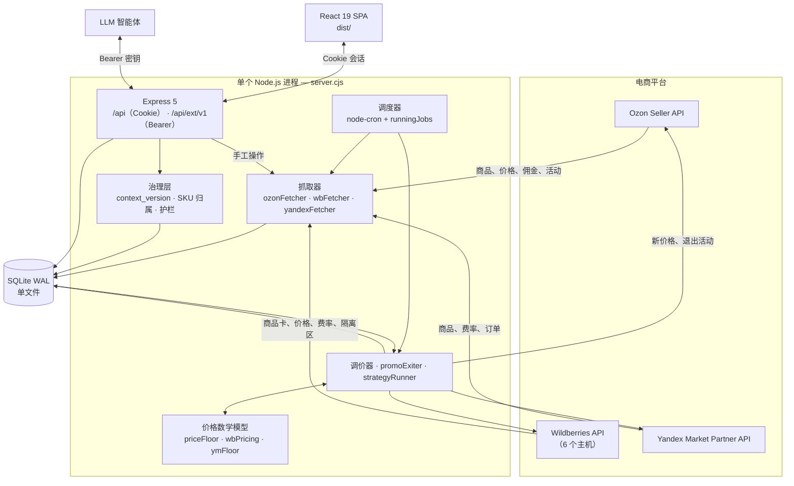

# 架构

本文面向准备修改代码的开发者，描述系统的**实际**结构，而不是理想结构。所有结论均已对照代码核实；代码中没有依据的地方，文中会明确说明「未记录」。

用户操作场景见[用户指南](user-guide.md)，机器接口见[外部 API](api-external.md)，价格搜索算法见[定价策略](strategies.md)。

---

## 1. 整体结构

整个系统是**单个 Node.js 进程**。HTTP 服务（Express 5）和调度器（node-cron）运行在同一进程、同一内存空间中：`server.cjs` 启动 Express，并在 `listen()` 回调里调用 `scheduler.startScheduler()`。没有消息队列，没有 worker 进程，也没有独立的 cron 容器。全部状态保存在一个 WAL 模式的 SQLite 文件中。

这是有意的取舍：一条命令即可部署，但无法水平扩展。**绝不能对同一个数据库启动第二个进程实例** —— 并发任务的互斥保护存放在进程内存中，而不是数据库里（见下文）。



### 并发保护：`runningJobs`

`scheduler.cjs` 中声明了模块级的 `const runningJobs = new Set()`。任务开始前把键写入集合，`finally` 中删除：

| 键 | 任务 |
|---|---|
| `sync-<store_id>` | 店铺同步 |
| `repricer-<store_id>` | 调价器运行 |
| `promoexit-<store_id>` | 自动退出促销活动 |
| `monitor-<store_id>` | 状态监控（仅 Ozon） |
| `verifier` | 价格回验（全局） |
| `executor` | 定时更新执行（全局） |

修改这部分代码前必须记住两点：

1. **集合存在于内存中。** 进程重启即清空；同一数据库上的两个进程互相看不到对方的键，会同时向平台写价格。
2. **只有一处显式的跨任务互斥**：同一店铺的 `repricer-<id>` 正在运行时，`promoexit-<id>` 不会启动。两者都会写价格，同时运行会造成真实的竞争（日志：`PromoExit for … postponed — repricer is running`）。其他任务之间没有这种检查。

---

## 2. `server.cjs` 中的中间件顺序

这里的顺序不是形式问题：顺序错了，要么登录失效，要么机器接口被 Cookie 鉴权拦截。

```
1.  FORCE_PUBLIC_DNS（最先）        — 启用时替换 dns.lookup
2.  require('./sentry.server.cjs')  — 必须早于 express 与调度器
3.  cors({ origin: allowlist, credentials: true })
4.  app.all('/api/auth/{*path}', toNodeHandler(auth))
5.  express.json({ limit: '10mb' })
6.  请求日志（>1s 以及全部 4xx/5xx）
7.  app.use('/api/ext/v1', rateLimit, requireApiKey, audit, external)
8.  app.use('/api/...', requireAuth, requirePermission('repricer'), ...)
9.  Sentry.setupExpressErrorHandler(app)
10. 全局错误处理
11. express.static('dist') + SPA 兜底路由 app.get('/{*path}')
```

原因如下：

- **`FORCE_PUBLIC_DNS` 位于文件第一行**，早于任何可能打开套接字的 `require`。它把 `dns.lookup` 换成经 8.8.8.8 / 1.1.1.1 的 `dns.resolve4`。默认关闭，因为它会改变整个进程的域名解析行为 —— 这应由主机所有者决定，而非由库替他决定。
- **Sentry 早于 express 和调度器**，否则 http 钩子与 `unhandledRejection` 会挂在已创建的对象上，部分异常会丢失。
- **better-auth 必须在 `express.json()` 之前** —— 这是 better-auth 自身的要求：它的 node handler 直接从流中读取请求体。若 `express.json()` 先消费了流，handler 拿到的就是空体，登录随即失败。「整理中间件顺序后登录悄悄失灵」几乎都是这个原因。
- **`/api/ext/v1` 必须挂载在受 Cookie 保护的 `/api` 之前。** Express 5 中 `app.use('/api', requireAuth, …)` 按前缀匹配，若外部 API 挂载在后面，就会被 `requireAuth` 抢先拦截并返回 `401`，而不会去校验 Bearer 密钥。该块内部的顺序同样重要：`rateLimit` → `requireApiKey` → 审计 → 路由，即限流早于密钥校验（爆破密钥对服务端应保持廉价），审计只在 `res.on('finish')` 中对非 GET 请求写入。
- **CORS 使用显式白名单**：`TRUSTED_ORIGINS`，否则取 `BETTER_AUTH_URL`，再否则取 `http://localhost:$PORT`。在 `credentials: true` 的同时回显任意 `Origin`，等于让任何网站都能借用用户的会话 Cookie。完全不带 `Origin` 的请求（curl、智能体）予以放行。
- **SPA 兜底路由必须最后注册**，否则会吞掉 `/api/*`。

授权分两级：`requireAuth` 把 better-auth 会话解析为 `req.user`，`requirePermission('repricer')` 检查 `user.role` —— `admin` 一律放行，其余把角色字符串按逗号拆成权限列表。`/api/docs` 只要求登录。

---

## 3. 分层

```
server.cjs
  └─ routes/*.cjs        HTTP 层：解析、校验、状态码
       └─ db/*.cjs       数据访问：SQL、事务、聚合
       └─ lib/*.cjs      纯逻辑：数学模型、API 客户端、解析器
  └─ scheduler.cjs
       └─ *Fetcher.cjs、repricer.cjs、promoExiter.cjs、strategyRunner.cjs
```

- **`routes/`** —— 12 个路由器，内部几乎没有业务逻辑。`wrap`（`middleware/asyncHandler.cjs`）把异步处理器的异常转交全局处理器，`validateId`（`middleware/validate.cjs`）校验路径参数。
- **`db/`** —— 14 个模块合并成一个门面：`db/index.cjs` 用展开语法合并为一个对象（`{...require('./stores.cjs'), ...}`），根目录的 `db.cjs` 只是一行再导出。因此全项目统一写 `const db = require('./db.cjs')` 并平铺调用 `db.getStoreById(...)`。副作用是：**所有 `db/` 模块的函数名共享同一个扁平命名空间** —— 新增函数时须确认名字未被占用，否则列表中靠后的模块会静默覆盖靠前的。
- **`lib/`** —— 与 HTTP 和数据库都无关的部分：三套价格模型、策略引擎、贝叶斯需求估计、Excel 解析器、HTTP 客户端工厂、S3 备份、API 诊断。这也正是系统中被测试覆盖的部分（见第 9 节）。
- **`db/connection.cjs`** 是唯一创建 better-sqlite3 连接的地方。`auth.mjs` 通过 `createRequire` 复用同一个连接，避免 better-auth 与应用对同一文件开出两个驱动。

### 抓取器与平台无关的分发

| 文件 | 平台 | 特点 |
|---|---|---|
| `ozonFetcher.cjs`（848 行） | Ozon | 商品、价格、库存同步，可见性、活动、禁止自动加入活动 |
| `wbFetcher.cjs`（463 行） | Wildberries | 商品卡、价格+折扣、隔离区、佣金、箱型物流费率、异步报表取库存 |
| `yandexFetcher.cjs`（812 行） | Yandex Market | 商品、价格、`tariffs/calculate`、订单、隔离区 |

选择由 `scheduler.cjs` 中的一个函数完成：

```js
function getFetcher(platform) {
    if (platform === 'yandex') return require('./yandexFetcher.cjs');
    if (platform === 'wildberries') return require('./wbFetcher.cjs');
    return ozonFetcher;
}
```

分发依据是 `stores.platform` 字段（`'ozon' | 'wildberries' | 'yandex'`，默认 `'ozon'`）。共同契约是 `syncStore(storeId)`；但价格下发**并未完全统一**：Ozon 与 WB 实现 `updateProductPrices(...)`，而 Yandex 调用的是签名不同的 `updatePrices(campaignId, apiKey, …)`，因此 `scheduler.cjs` 与 `routes/external.cjs` 中仍保留显式的 `if (platform === 'yandex')` 分支。这种不对称并非疏忽：Yandex 的凭据绑定的是 campaign，而不是卖家账号。

上层逻辑同样按平台分叉，但粒度较大：对 Wildberries，`repricer.checkStore()` 直接转入 `enforceWbRepricing()`（通过移动基准价、保持卖家折扣来守住指导价）；对 Yandex 则转入 `enforceYandexFloor()`。

---

## 4. 数据库结构

单个 SQLite 文件（`DB_PATH`，默认 `./ozon.db`），`journal_mode = WAL`、`synchronous = NORMAL`、`foreign_keys = ON`。驱动是 better-sqlite3，**同步执行**：查询不会让出事件循环，因此一条慢查询会阻塞整个进程的 HTTP 处理。

### 数据表

| 表 | 用途 |
|---|---|
| `stores` | 店铺：名称、平台、全部凭据（Ozon 的 `client_id`/`api_key`，`ym_business_id`/`ym_campaign_id`/`ym_api_key`，`wb_api_key`）、同步/调价/监控间隔、偏差阈值、`tax_rate`、`min_margin_percent`、促销守卫与自动退出开关及活动白名单、`strategy_kill_switch`。主键为 UUID（TEXT）。 |
| `products` | 店铺商品。`ozon_id` 为平台数字 ID（WB 存 **nmID**），`offer_id` 为卖家货号（WB 为 **vendorCode**）。同时保存基准价 `ref_price`/`ref_min_price`、`cost_price`、计算得到的 `floor_min_price`、状态字段（`visibility`、`is_quarantine`、`in_promo`、`promo_price`、FBO/FBS 库存）、WB 专有字段（`wb_subject_id`、`wb_volume_liters`、`wb_price_base`、`wb_discount`）、策略字段（`strategy_type`、`in_experiment`、价格区间）以及治理字段（`management_mode`、`managed_by`、`freeze_reason`）。唯一约束 `(store_id, ozon_id)`。 |
| `price_history` | 商品价格历史：`price`、`marketing_price`、`min_price` 及时间戳。 |
| `sync_logs` | 一次运行的头部记录（同步、调价、监控）：状态、计数、起止时间。 |
| `sync_log_entries` | 运行的逐条日志：`level`、`stage`、`message` —— 即日志弹窗中显示的内容。 |
| `price_imports` | 上传的价格表：路径、状态、结果 JSON。旧文件会被清理（每店铺保留最近 3 个）。 |
| `price_updates_pending` | 已下发、等待回验的价格：`sent_price`、`verify_after`、`status`（`PENDING` → `VERIFIED_OK` / `VERIFIED_FAIL` / 过期）。 |
| `price_snapshots` | 批量操作前的价格快照 —— 回滚的依据，另有 `category` 与 `comment`。 |
| `scheduled_updates` | 定时价格变更：`scheduled_at`、`updates_json`、`status`（`SCHEDULED` → `EXECUTED`/`ERROR`）。 |
| `api_logs` | 所有平台 API 调用记录：端点、状态码、耗时、批量大小、来源（`sync`/`repricer`/`monitor`/…）、重试次数、错误响应体。降级检测器的数据来源。 |
| `repricer_log` | 调价器逐 SKU 的决策：`action`（`ok`、`corrected`、`skipped_promo`、`skipped_quarantine`、`skipped_below_cost`、`skipped_bad_ref` 等）、原价/新价/基准价、偏差、原因。 |
| `app_settings` | 键值设置：`context_version`、`policy_*`、策略全局急停开关、Performance API 凭据（`perf_api_<store_id>`）、外部 API 运行时开关。 |
| `external_api_log` | 外部 API 写操作审计：IP、方法、路径、状态码、店铺、动作、影响 SKU 数。 |
| `sales_daily` | 销售数据集市：每个 `(店铺, offer_id, 日期)` 一行 —— 件数、收入、利润、价格、单位成本、佣金、floor、促销标记、广告支出、库存、「脏数据日」标记以及 λ 的后验估计。定价策略的燃料。 |
| `experiments` | 单 SKU 的实验状态：策略类型、当前价格、步长、方向、最优点、连续劣化计数、`auto_apply`。唯一约束 `(store_id, offer_id)`。 |
| `strategy_log` | 策略引擎决策日志：动作、原价/新价、指标、原因、是否已应用。 |
| `agent_decisions` | 智能体的决策/意图/规则日志（`kind`：`decision` \| `intent` \| `policy`），带作用范围（单店铺或全部）与有效期。 |
| `agent_acks` | 哪个智能体确认了哪个 `context_version`。 |

better-auth 的表（`user`、`session`、`account`、`verification`）不在本 schema 中：由 better-auth 自行创建 —— `auth.mjs` 对同一个数据库文件调用 `getMigrations(auth.options)` 与 `runMigrations()`。

索引与表结构声明在一起，热点路径为 `sales_daily(store_id, offer_id, date)`、`price_updates_pending(status, verify_after)`、`scheduled_updates(status, scheduled_at)`、`api_logs(store_id, timestamp)` 以及 `products(store_id, visibility|is_quarantine|in_promo)`。

### 迁移方式

**没有 schema 版本表。** 既没有 `schema_version`，也没有迁移文件目录，更没有 `migrate` 命令。取而代之的是：`db/connection.cjs` 在模块加载时（即每次进程启动时）依次执行：

1. `initSchema()` —— 一大段 `CREATE TABLE IF NOT EXISTS …` 加 `CREATE INDEX IF NOT EXISTS …`。
2. `runMigrations()` —— 一份所需列的清单，每一列都通过 `alterSafe()` 添加：

```js
function alterSafe(sql, colName) {
    try { db.prepare(sql).run(); }
    catch (err) {
        if (!err.message.includes('duplicate column name')) { … }
    }
}
```

也就是说 `ALTER TABLE … ADD COLUMN` 总会执行，而「列已存在」的错误被吞掉。迁移天然幂等，顺序即数组顺序，不存在回滚（`down`）。

扩展时的规则：**新列要加进 `storeColumns` / `productColumns` 数组，而不是加进 `initSchema()`** —— `CREATE TABLE IF NOT EXISTS` 不会改动已存在的表，生产库上这一列永远不会出现。首个版本之后新增的表和索引同理，应通过 `runMigrations()` 中的 `execSafe(CREATE TABLE IF NOT EXISTS …)` 添加（`agent_acks` 与 `agent_decisions` 就是这样加入的）。

结构性迁移共有两处，都带 guard 条件，且都在 `foreign_keys = OFF` 的事务中执行：

**A. 修复指向 `stores_old` 的外键。** guard 是一次 `sqlite_master` 查询：

```sql
SELECT name, sql FROM sqlite_master WHERE type='table' AND sql LIKE '%stores_old%'
```

无匹配则什么也不做；有匹配时，每张受影响的表以修正后的 DDL 建成临时表，复制数据，删除旧表，再改名。

**B. 把 `stores.id` 从 INTEGER 改为 UUID。** guard 是首行值的存储类型：

```sql
SELECT typeof(id) as t FROM stores LIMIT 1
```

只有当 `t === 'integer'` 时才调用 `migrateStoresToUUID()`：以 `id TEXT PRIMARY KEY` 重建表（其余列由 `PRAGMA table_info` 还原），为每个店铺生成 `crypto.randomUUID()`，并按映射表重写所有子表（`products`、`sync_logs`、`price_imports`、`price_updates_pending`、`price_snapshots`、`scheduled_updates`、`api_logs`、`repricer_log`）中的 `store_id`。

顺序上的一个微妙点：迁移 B 使用 `ALTER TABLE stores RENAME TO stores_old`，而 SQLite 在改名时会自动把子表的外键改写成指向 `stores_old`。清理这些残留正是迁移 A 的职责 —— 但 A 在代码中位于 B **之前**，因此它是在**下一次**启动时才完成修复，而非同一次。全新安装时两个分支都不会触发。

---

## 5. 调度器

`scheduler.cjs` 注册四个 cron 任务和一次启动时的一次性调用。

| 计划 | 执行内容 | 目的 |
|---|---|---|
| `* * * * *`（每分钟） | 主循环：遍历所有店铺，启动到期的任务 | 系统唯一的「心跳」。各店铺的间隔不是 cron 表达式，而是对店铺字段做 `now − last_run > interval` 比较 |
| `0 <BACKUP_HOUR> * * *`（默认 03:00） | `runBackup(rawDb)` —— 将数据库导出至 S3 兼容存储 | 在早间任务之前备份；S3 变量为空时禁用 |
| `0 4 * * *` | 对每个店铺：先 `salesCollector.collectStoreSales(id, {days: 2})`，再 `strategyRunner.runStore(id)` | 先把昨日销量收进 `sales_daily`，再据此做定价决策。两天的窗口是给平台报表延迟留的余量 |
| `10 * * * *`（每小时第 10 分钟） | 对每个非 Yandex 店铺执行 `getDegradations(store.id)`，告警发往 Sentry | **基于已累积的 `api_logs`** 检测端点降级，不向平台发一个请求 —— 调价器自身的流量已提供足够统计 |
| 启动时一次 | `db.expireOldPending(3)` | 清理卡住的价格回验记录（例如无法回验的店铺） |

主循环内部按以下顺序执行：

1. **同步** —— 当 `now − last_updated_at > update_interval_minutes` 时，以 `sync-<id>` 为键运行 `getFetcher(platform).syncStore(id)`；fire-and-forget，配 `.catch()` 与 `.finally()`。
2. **调价器** —— 当 `repricer_enabled` 开启且 `now − last_repricer_run > repricer_interval_min`（默认 15 分钟）时运行 `repricer.checkStore(id)`。
3. **自动退出活动** —— 间隔由常量 `PROMO_EXIT_INTERVAL_MIN = 5` 决定。Ozon 走 `promoExiter`（取消参与并设置禁止自动加入的标记）；Wildberries 走 `wbPromoExiter`，通过恢复价格/折扣对实现，因为 WB 根本没有「退出活动」的接口。若同一店铺的 `repricer-<id>` 正在运行，该任务顺延。
4. **状态监控**（`runStatusMonitor`）—— 仅 Ozon（`yandex` 与 `wildberries` 跳过：WB 的可见性与隔离区在 `syncStore` 内刷新）。间隔为 `monitor_interval_min`，默认 30。刷新可见性、隔离/归档/库存标记，先清空再重新标记促销状态；若 `promo_guard_enabled` 开启**且** `promo_exit_enabled` 关闭，则调用 `promoGuard.checkStore()` —— 两者同时运行会发出重复的 `deactivate`。
5. **回验器**（`runVerifier`）—— 取出 `verify_after`（下发时间 + 3 分钟）已到的 `price_updates_pending` 记录，按店铺分组，以每批 1000 个 `offer_id` 调用 `/v5/product/info/prices` 读取实际价格：差异不超过下发价的 1% 记 `VERIFIED_OK`，否则记 `VERIFIED_FAIL` 并写明差异。Yandex 与 WB 店铺跳过：WB 通过任务异步生效，其控制走 `syncStore` 中的隔离区检查。
6. **定时任务执行器**（`runScheduledExecutor`）—— 取出到期的 `scheduled_updates`，解析 `updates_json`（JSON 损坏则置为 `ERROR` 并在日志中记录片段），下发价格，创建 `price_updates_pending` 记录并写回状态。
7. **旧数据轮转** —— `maybeRotateOldData()` 通过内存变量 `lastRotation` 实现自制的「每天一次」；进程重启后第一个 tick 就会执行一次轮转。

`stopScheduler()` 停止全部四个任务；`server.cjs` 在 `SIGTERM`/`SIGINT` 的 `gracefulShutdown` 中调用它，随后关闭 HTTP 服务与数据库，若 25 秒内未完成则强制退出。

---

## 6. 三套价格模型

项目中刻意没有「一套公式加平台开关」的做法。各平台的经济模型差异之大，统一公式至少对其中一个平台是错的。

### Ozon —— `lib/priceFloor.cjs`

```
floor = ⌈ ( cost·(1 + margin%) / (1 − tax%) + logistics + acquiring ) / (1 − commission%) ⌉
```

输入取自 `/v5/product/info/prices` 的实时响应：佣金取 `sales_percent_fbo`，为零时退回 `sales_percent_fbs`；物流取 `fbo_direct_flow_trans_min_amount`（或 FBS 对应字段）；收单费取 `acquiring` 字段。

当成本 ≤ 0、**`tax_rate` 不在开区间 (0, 100) 内**，或佣金不在 (0, 100) 内时，函数返回 `null`，即「不计算 floor」。实际后果是：**`tax_rate = 0` 的 Ozon 店铺完全没有 floor 保护** —— `repricer.cjs` 中的 Ozon 分支还额外套了一层 `if (store.tax_rate > 0)`。

### Wildberries —— `lib/wbPricing.cjs`

```
floor = ⌈ ( cost·(1 + margin%) / (1 − tax%) + logistics + returnLogistics ) / (1 − (commission% + acquiring%)) ⌉
```

与 Ozon 的差异：

- 收单费在这里是**百分比**（默认 1.5%），与佣金一起进入分母，而不是以金额形式加在分子上。
- **`tax = 0` 被视为 0% 税率，而非「关闭」** —— 即使卖家未填税率，保护依然生效。函数注释对此有明确说明。
- 物流按箱体体积计算：`computeBoxLogistics(V, tariff) = base + max(0, ⌈V⌉ − 1) · liter`，体积由商品卡尺寸换算（cm³ → 升）。退货物流按 `logistics · (1 − buyoutShare)` 计入，签收率常量 `0.7` 硬编码在 `repricer.cjs` 中。
- 佣金按类目取，依据 `wb_subject_id`（FBO 费率）。

除 floor 之外，WB 还有「价格该怎么设」的问题：买家看到的是 `discountedPrice = price · (1 − discount/100)`，而接口接收的是这一对值。`computeWbPricePair(target, currentDiscount)` **保留卖家折扣**（它既是锚点，也是争取更高平台补贴折扣的信号），转而移动基准价：`base = ⌈target / (1 − discount/100)⌉`。向上取整保证卖家到手价不会低于目标价，因而也不会低于 floor。若折扣不在 1…99 区间内，则退化为 `{price: target, discount: 0}`。

### Yandex Market —— `lib/ymFloor.cjs`

```
floor = ⌈ ( cost·(1 + margin%) + absFees ) / (1 − (pctFees% + tax% + boost%)) ⌉
```

这里**所有与售价成比例的扣项统一进入分母**：来自 `tariffs/calculate` 的百分比扣项（类目佣金、收款与转账、配送至买家）、税率，以及推广竞价费率。固定扣项（中段运输、分拣）以金额形式进入分子。

为什么是另一套模型，而不是同一套换系数：

- **税按销售总额（毛额）计，而不是按扣除佣金后的净额计。** 简易税制「收入」按整笔销售额征收。Ozon/WB 公式中税是嵌在分子里的（`cost/(1 − tax)`），即视作对卖家想拿到的净额征税。`ymFloor.cjs` 的注释明确指出这一差异是刻意的，并说明 Yandex 分支此前沿用 Ozon 式公式属于 bug。
- **推广竞价费率没有任何费率接口返回。** 只能从实际数据反推 —— 取自 `stats/orders` 的 `bidFee` —— 并加入同一个分母。
- 设有保险丝：当比例扣项之和 ≥ `ANOMALY_PERCENT`（95%）时函数返回 `null`。此时分母接近零，类目数据一旦有误 floor 就会趋于无穷大。

同文件中还有 `computeYmSellerPayout(...)`，用于计算某笔销售的实际到手金额。它以**显式相减**的方式扣除费用，而不是走分母，用于监控真实亏损（`YM_SOLD_BELOW_FLOOR` 指标）；结果可以为负。

### 主价格

`lib/masterPricing.cjs` 把单一的「买家应看到的价格」展开成各平台的规则：

- **Ozon / Yandex**：`price = master`；`min_price` 取已设置的 `ref_min_price`，否则取 `master · 0.5`；`old_price = computeOldPrice(price, min_price)` = `max(⌈price·1.25⌉, ⌈min_price·2⌉, price + 1)` —— 同时满足 Ozon 的两条约束：划线价高于现价，且不低于两倍 `min_price`。
- **Wildberries**：由 `computeWbPricePair` 得到 `{price, discount}` 对，使 `discountedPrice` 等于主价格。

---

## 7. 治理层

`db/governance.cjs`（234 行）解决的是普通调价器不会遇到的问题：**多个 LLM 智能体在多个不同会话中管理同一份商品目录**，每一个掌握的信息都不完整。这本质上是并发访问问题，因此也按并发访问问题来解决。

### 类比：乐观锁（ETag / If-Match）

HTTP 中，客户端读取资源得到 `ETag`，写入时带上 `If-Match: <etag>`；若期间资源已变，服务端返回 `412 Precondition Failed`，客户端必须重新读取。

这里是同一套机制，只不过版本号覆盖的是**整个知识域**，而非单个文档：

| HTTP | 调价器 |
|---|---|
| `GET /resource` → `ETag: "42"` | `GET /context` → `context_version: 42` |
| `PUT` + `If-Match: "42"` | `POST /stores/:id/prices` + `context_version: 42` |
| `412 Precondition Failed` | `409 context_stale` —— **同一响应中直接附带最新上下文** |
| 不带 `If-Match` 的写入被允许 | 不带版本号的写入被拒绝：`428 context_version_required` |

与经典 ETag 有两处刻意的差异。其一，`409` 直接返回上下文，智能体无需第二次往返即可重新决策。其二，缺少版本号是**错误**，而不是「可以写」：一个被遗忘的字段绝不应该改动真实价格。

版本号是 `app_settings.context_version` 中的计数器，任何共享知识发生变化时由 `bumpContextVersion()` 递增：新增决策、关闭决策、变更 SKU 管理模式。

### 四个层次

1. **带版本的上下文。** `getContext()` 汇总：`context_version`、生效中的策略参数、受管 SKU 映射（`platform:store:offer_id` → 模式、归属者、原因、维持价）、有效决策、确认（ack）列表，以及一段面向智能体的文字 `contract`。

2. **SKU 归属。** `products.management_mode` ∈ `ref_price | experiment | liquidation | disposal`，外加 `managed_by`。
   - `ref_price` —— 常规模式：调价器守住价格，外部智能体可在校验下写入；
   - `experiment` / `liquidation` —— **只有归属者**（`managed_by`）可写，他人写入返回 `sku_owned`。例外是 `agent: 'user'`，即真人；
   - `disposal` —— 商品已退出流通，**任何**价格写入都会被拒绝（`sku_disposal`），`repricer.cjs` 同样跳过这些 SKU。

3. **决策日志** —— `agent_decisions` 记录三类内容：`decision`（已决定）、`intent`（提前声明的意图）、`policy`（规则）。每条都有作用范围：单个店铺或全部店铺 —— 因为同一个 `offer_id` 可能在一家店铺盈利，而在另一家正在清仓。

4. **策略护栏**（`validatePriceUpdates`）—— 在价格发往平台之前拦下「自信的胡来」：
   - `policy_price_change_max_pct`（默认 15）—— 单次写入相对基准价的最大偏离；`liquidation` 模式豁免；
   - `policy_mass_change_limit`（200）—— 单次超过该数量的 SKU 必须带 `confirm_mass: true`；
   - `policy_require_floor`（`true`）—— 未算出 floor 的 SKU 一律以 `no_floor` 拒绝。这堵住了最廉价的亏损通道：过去没有成本价的商品会静默放行任何价格；
   - 价格低于 `floor_min_price` → `below_floor`。

   结果并非「全成或全败」：函数返回 `{accepted, rejected}`，每条被拒记录都带有错误码和可读原因。

策略参数保存在 `app_settings` 的 `policy_*` 键中，无需改代码即可调整。其中两项并不是数字，而是关于平台共投与计税基数的文字说明；它们会进入上下文与简报，目的是让智能体去读 `GET /stores/:id/pnl`，而不是自行编造利润算法。

### 简报与确认

`getBriefing()` 依据决策日志与 SKU 状态**实时生成一份 Markdown 文档**：带作用范围的有效决策、按店铺分组的各模式 SKU 汇总、当前生效的限制以及当前 `context_version`。`POST /briefing/ack {agent}` 把智能体阅读的版本写入 `agent_acks`（`ON CONFLICT DO UPDATE`，每个智能体一行）。`listAcks()` 会将每行与当前版本比对并标记 `up_to_date`，一眼即可看出谁的信息已经过时。

---

## 8. 平台特性与踩过的坑

以下内容摘自代码注释，几乎每一条都是事故之后写下的。

### Wildberries

- **进程级全局限流。** WB 对整个卖家账号施加严格限额，因此 `lib/wbClient.cjs` 为整个进程维护一条队列（`globalChain`、`MIN_REQUEST_INTERVAL_MS = 1200`，约每 6 秒 5 个请求并留有余量）。按客户端各自排队没有用：同步、调价、退出活动各自创建客户端，合在一起就会突发并触发 `429`。重试最多 3 次，优先按 `X-Ratelimit-Retry` 响应头等待，否则指数退避。
- **没有统一的 `baseURL`。** 按方法族分为六个主机（`content`、`prices`、`calendar`、`common`、`analytics`、`statistics`），客户端创建时不设 base URL，完整 URL 由抓取器拼装。
- **不要自定义 IPv4 agent。** 注释记录：带 `keepAlive` 的自定义 agent 会导致 `discounts-prices-api` 上的套接字挂死；WB 主机不提供 AAAA 记录，默认解析器足以应对。
- **降价过猛会进隔离区。** 价格降幅约达 1.5–3 倍时，WB 会把商品放入价格隔离区，新价格根本不会生效。因此 `repricer.cjs` 采用阶梯降价：`QUAR_RATIO = 1.5`，若目标价比当前价低出 1.5 倍以上，本轮只降到 `⌈current / 1.45⌉`（`QUAR_STEP = QUAR_RATIO − 0.05`，避免正好卡在阈值上），余下部分由后续轮次完成。同时 `fetchQuarantine()` 读取 `/api/v2/quarantine/goods` 并在同步日志中写入告警。
- **价格异步生效。** WB 返回 `taskId`；是否真正生效不由回验器判断，而是通过隔离区和 `syncStore` 中重新读取价格来确认。
- **Excel 导入不会向 WB 下发价格。** 导入只写入基准价与成本价，下发交由调价器完成 —— 直接推送会破坏 `price`/`discount` 组合，并可能把商品送进隔离区。
- **已下线的库存接口。** `statistics-api /api/v1/supplier/stocks` 自 2026 年 08 月起返回 404；库存改用异步报表 `warehouse_remains`（创建 → 每 10 秒轮询状态、最长 150 秒 → 下载）。
- **数字可能以带逗号的字符串返回**（`"0,5"`），抓取器中的 `parseNum` 即为此而设。

### Yandex Market

- **强制 IPv4。** 在编写该代码的服务器上，`dns.lookup` 只返回 IPv6，因此 `lib/yandexClient.cjs` 自定义了基于 `dns.resolve4` 的查询，重试 5 次、间隔 200 毫秒 —— Yandex 的 `ENODATA` 往往是瞬时的。
- **每次写价格都必须带 `discountBase`**，且必须保持有效：由它推出的折扣要落在 5–99% 区间内。于是有了 `baseFor(value)`：若现有基准价 ≥ `⌈value·1.06⌉` 则保留，否则取 `⌈value·1.25⌉`。
- **空响应与错误无法区分。** 隔离区读取处的注释写得很直白：异常导致的空 `Set` 看上去和「隔离区为空」一模一样 —— 这正是 405 事故的模式，因此返回结果时会同时带上错误标记。
- **凭据绑定 campaign** 而非店铺：`ym_business_id` + `ym_campaign_id` + `ym_api_key`，这也是 `updatePrices` 签名与 Ozon/WB 不同的原因。
- **Yandex 的 floor 始终计算**，即便 `tax_rate = 0` 也只是给出警告，而不像 Ozon 分支那样静默跳过。

### Ozon

- **`min_price` 不得低于价格的 50%。** 否则平台会以 `min_auto_price_too_small` 拒绝**该商品的整个更新**，价格无法恢复。调价器的处理是：若取回的 `min_price` 大于零但小于 `refPrice · 0.5`，则提升到 `⌈refPrice · 0.5⌉`。
- **`old_price` 同时满足两条约束** —— 大于 `price`，且不小于 `2 × min_price`（`computeOldPrice`）。
- **HTTP 200 里藏着错误。** Ozon 对 `/v1/product/import/prices` 返回 200，而单条商品的拒绝信息藏在 `result[].errors` 中。代码将其解析进 `data._itemErrors`，写入 `api_logs`（可越过 docker 日志轮转并在界面中查看），并以 warning 上报 Sentry。把这种响应当成成功，是「应用了一个并不存在的价格」的最简单方式。
- **过滤条件上限 1000 条。** `/v5/product/info/prices` 的 `Filters.OfferIds` 在回验器与调价器中都按 1000 分块。
- **429 → 指数退避**（`1000 · 2^attempt`，最多 3 次）。
- **3 分钟后回验、容差 1%** —— 更严的阈值会因平台侧取整而产生大量误报的 `VERIFIED_FAIL`。
- **广告是另一套体系。** Performance API 使用不同的凭据与主机（`api-performance.ozon.ru`；旧的 `performance.ozon.ru` 已弃用）；`client_credentials` 令牌有效期 30 分钟并被缓存。凭据存放在 `app_settings` 的 `perf_api_<store_id>` 键下。

### 基础设施

- **Dockerfile 中的 `COPY *.cjs ./` 是刻意的整体拷贝。** 注释说得很明确：不要逐个列出文件，否则新增的根级模块会悄悄漏进镜像，运行时以 `MODULE_NOT_FOUND` 崩溃。
- **两个构建阶段都装 `py3-setuptools`。** Python 3.12 移除了 `distutils`，而 better-sqlite3 内置的旧版 node-gyp 仍在 import 它；setuptools 自带的副本可把它补回来。
- **从 `dist` 中删除 source map。** 构建使用 `sourcemap: 'hidden'`，产物中没有 `//# sourceMappingURL=`，但 `.map` 文件仍会生成，因此 Dockerfile 用 `find dist -name '*.map' -delete` 清除。
- **`FORCE_PUBLIC_DNS=1`** 是为解析器无法访问平台 API 的主机准备的应急开关 —— 典型场景是 Docker 内置的 127.0.0.11 DNS 代理，它对部分 Ozon/Yandex 域名的解析并不稳定。默认关闭，因为它会改变进程的**所有**域名解析。

---

## 9. 测试

共 141 个测试，运行命令 `npm test`（Vitest，jsdom 环境，`passWithNoTests: true`）。

### 已覆盖

| 文件 | 用例数 | 内容 |
|---|---|---|
| `db/__tests__/cockpit.test.mjs` | 22 | 驾驶舱查询：告警类型、风险金额、聚合 |
| `src/utils/__tests__/formulaParser.test.ts` | 16 | 批量编辑的公式解析器 |
| `lib/__tests__/strategyEngine.test.mjs` | 15 | 策略引擎：步进、滞回、回退、收敛 |
| `src/components/products/__tests__/StatusBadge.test.ts` | 12 | 商品状态展示 |
| `lib/__tests__/wbPricing.test.mjs` | 11 | WB 的 floor、箱型物流、价格/折扣对 |
| `lib/__tests__/ymFloor.test.mjs` | 10 | Yandex 的 floor、≥95% 异常保护、卖家到手金额 |
| `src/components/dashboard/__tests__/CockpitCharts.test.tsx` | 10 | 驾驶舱图表 |
| `lib/__tests__/apiKeyAuth.test.mjs` | 8 | 外部 API：密钥校验、恒定时间比较、IP 白名单、限流 |
| `lib/__tests__/masterPricing.test.mjs` | 8 | 由主价格推导各平台价格 |
| `src/components/dashboard/__tests__/TaskCard.test.tsx` | 7 | 任务卡片 |
| `src/components/ui/__tests__/Modal.test.tsx` | 6 | 模态框 |
| `lib/__tests__/bayesPoisson.test.mjs` | 5 | Gamma-Poisson 后验与分位数 |
| `lib/__tests__/excelParser.test.mjs` | 4 | 数字解析（「1 300,50」、不换行空格）、正则匹配列名 |
| `lib/__tests__/strategyConvergence.test.mjs` | 4 | 阶梯搜索向最优点收敛 |
| `db/__tests__/pending-fk.test.mjs` | 3 | 待回验记录的外键完整性 |

覆盖逻辑很清晰：**凡是可能悄悄亏钱的地方都被测试** —— 价格数学、策略引擎、输入文件解析、外部 API 鉴权，以及告警所依赖的查询。这些都是无网络的纯函数，因此测试快速且确定。`lib/priceFloor.cjs`（Ozon）**没有专门的测试** —— 三套价格模型中唯一没有直接覆盖的一套。

此外还有 `scripts/simStrategy.cjs`：在合成线性需求上以蒙特卡洛方法把策略引擎与已知最优解对比。它是验证工具而非单元测试，需手动运行。

### 未覆盖

- **抓取器**（`ozonFetcher`、`wbFetcher`、`yandexFetcher`，约 2100 行）完全没有测试：它们依赖网络，而仓库中没有平台的 mock。
- **路由层** —— HTTP 层未做测试，依赖中也没有 supertest。
- **调度器** —— 计划表、`runningJobs`、以及「调价器运行时顺延退出活动」的规则均未测试。
- **治理层**（`db/governance.cjs`）—— 上下文版本控制、SKU 归属与策略护栏**没有测试**，尽管这是分支密集、极易测试的纯逻辑。这是覆盖率上最显眼的缺口。
- **`repricer.cjs` 整体**（855 行）—— 只有它调用的 `lib/` 函数被覆盖。
- **迁移** —— `alterSafe` 的幂等性与两处结构性迁移都没有自动验证。

---

## 相关文档

- [安装部署](installation.md)
- [用户指南](user-guide.md)
- [外部 API](api-external.md)
- [LLM 智能体说明](llm-agent.md)
- [定价策略](strategies.md)
